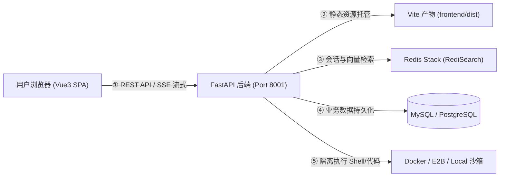
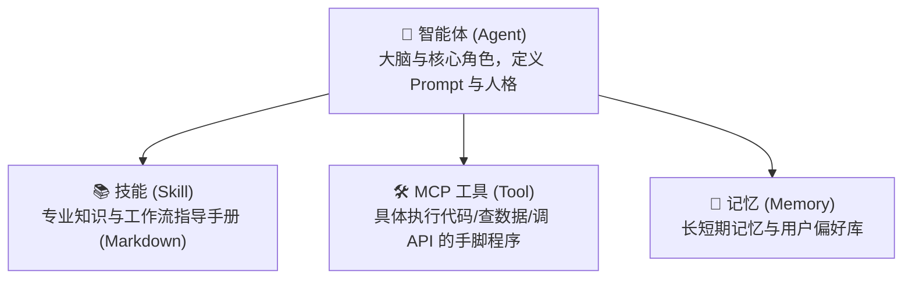
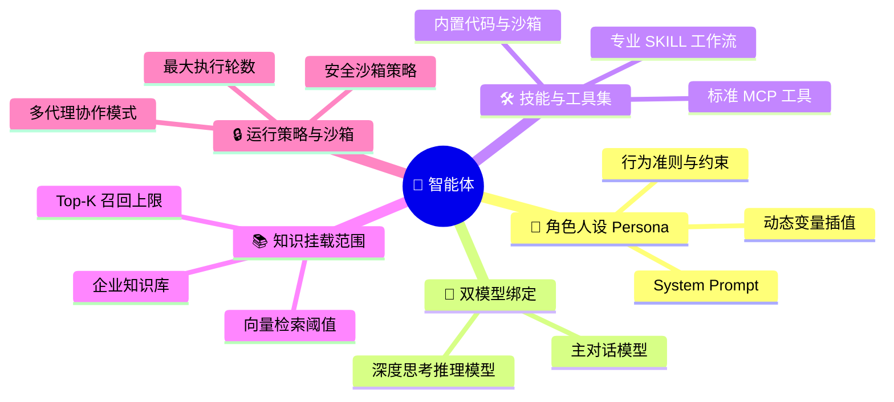
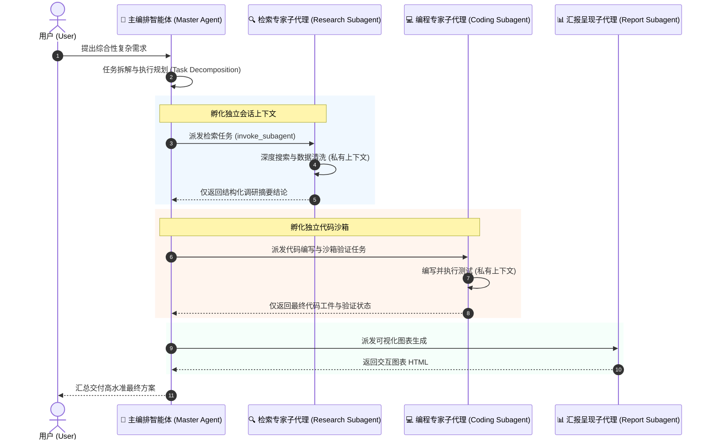
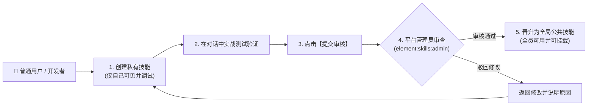
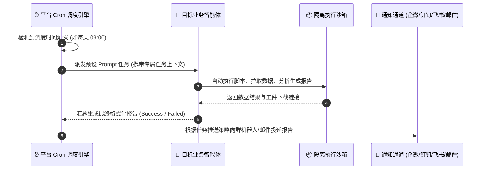
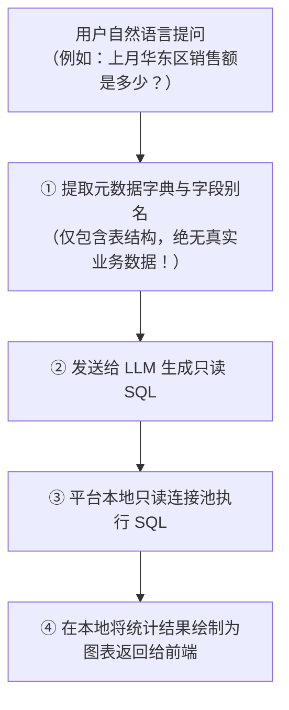
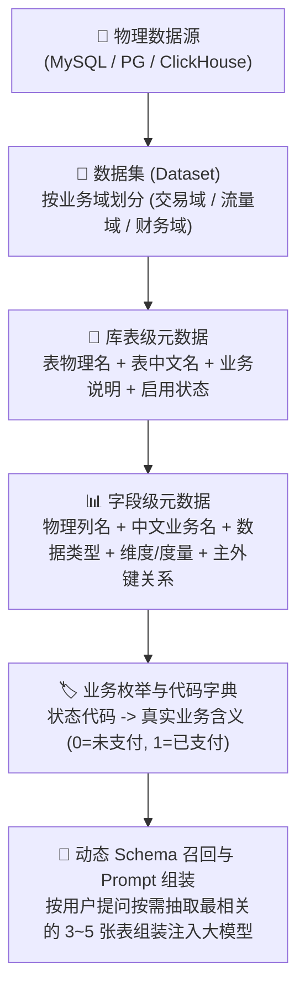
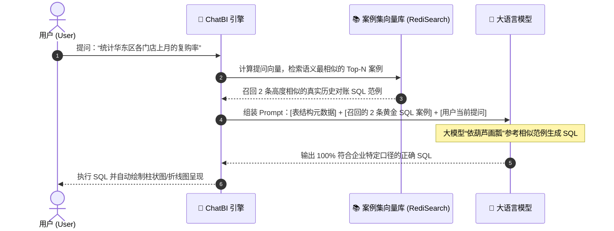
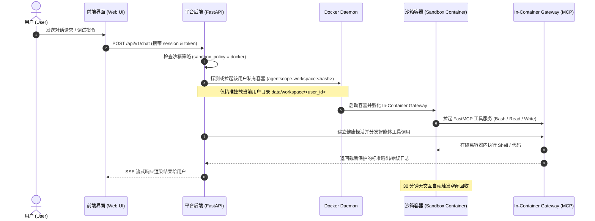

# NanZi AI 开源智能体平台 · 疑难解答与常见问题手册 (FAQ)

欢迎查阅 **NanZi AI 开源智能体平台** 常见问题与疑难解答手册。本手册按照平台左侧功能菜单结构进行编排分类，包含通俗易懂的原理机制解析、小白用户常见概念混淆答疑，以及各类运行环境配置与异常排查方法。

---

## 📑 目录导航 (Table of Contents)

- [一、平台概览与基础环境 (Overview & Environment)](#一平台概览与基础环境)
  - [1.1 推荐运行依赖与系统要求](#11-推荐运行依赖与系统要求)
  - [1.2 本地与服务器快速启动指南 (`dev.sh`)](#12-本地与服务器快速启动指南-devsh)
  - [1.3 核心逻辑：平台前后端是如何协作运行的？](#13-核心逻辑平台前后端是如何协作运行的)
  - [1.4 小白高频问题与排查 Q&A](#14-小白高频问题与排查-qa)
- [二、智能助手与交互画布 (Smart Assistant & Canvas)](#二智能助手与交互画布)
  - [2.1 核心逻辑：智能助手与交互画布的协同机制](#21-核心逻辑智能助手与交互画布的协同机制)
  - [2.2 输入框浮标：Token 水位线与沙箱状态卡片](#22-输入框浮标token-水位线与沙箱状态卡片)
  - [2.3 浏览器自动化会话与实时投屏接管](#23-浏览器自动化会话与实时投屏接管)
  - [2.4 小白高频问题与交互排查 Q&A](#24-小白高频问题与交互排查-qa)
- [三、智能体开发平台 (Agent Development Platform)](#三智能体开发平台)
  - [3.1 核心逻辑：智能体、技能 (Skill) 与 MCP 工具的区别与联系](#31-核心逻辑智能体技能-skill-与-mcp-工具的区别与联系)
  - [3.2 智能体中心与多 Agent 协作 (Agent Management)](#32-智能体中心与多-agent-协作)
    - [3.2.1 智能体核心构建的“五大要素”](#321-智能体核心构建的五大要素)
    - [3.2.2 多智能体协同编排与子代理机制 (Subagents Architecture)](#322-多智能体协同编排与子代理机制-subagents-architecture)
    - [3.2.3 嵌入式发布与一键共享 (Embed Chat)](#323-嵌入式发布与一键共享-embed-chat)
    - [3.2.4 小白实战：我该用单智能体还是多智能体？](#324-小白实战我该用单智能体还是多智能体)
  - [3.3 技能工作台与平台审核机制 (Skills Management)](#33-技能工作台与平台审核机制-skills-management)
    - [3.3.1 什么是技能 (Skill)？技能包的结构规范](#331-什么是技能-skill技能包的结构规范)
    - [3.3.2 私有技能 vs 平台公共技能及审核流转](#332-私有技能-vs-平台公共技能及审核流转)
    - [3.3.3 大模型是如何“动态发现与按需加载”技能的？](#333-大模型是如何动态发现与按需加载技能的)
  - [3.4 MCP 工具集规范与容器内网关 (MCP Management)](#34-mcp-工具集规范与容器内网关-mcp-management)
    - [3.4.1 什么是 MCP？为什么它是智能体进化的关键？](#341-什么是-mcp为什么它是智能体进化的关键)
    - [3.4.2 平台支持的 MCP 连接协议类型 (STDIO vs SSE)](#342-平台支持的-mcp-连接协议类型)
    - [3.4.3 Docker 安全沙箱中的 In-Container FastMCP 网关机制](#343-docker-安全沙箱中的-in-container-fastmcp-网关机制)
  - [3.5 记忆工作台与 30 天持久化缓存](#35-记忆工作台与-30-天持久化缓存)
  - [3.6 任务调度台 (Task Center) 与 Cron 定时任务](#36-任务调度台-task-center-与-cron-定时任务)
    - [3.6.1 任务中心核心运行原理](#361-任务中心核心运行原理)
    - [3.6.2 定时任务创建“四步指南”](#362-定时任务创建四步指南)
    - [3.6.3 任务执行实例与生命周期监控](#363-任务执行实例与生命周期监控)
  - [3.7 智能体单步调试 (Agent Debug) 与接口调试台 (Playground)](#37-智能体单步调试-agent-debug-与接口调试台-playground)
  - [3.8 小白高频问题与智能体排查 Q&A](#38-小白高频问题与智能体排查-qa)
- [四、ChatBI 开发平台 (ChatBI Platform)](#四chatbi-开发平台)
  - [4.1 核心逻辑：ChatBI 是如何安全查询企业数据的？](#41-核心逻辑chatbi-是如何安全查询企业数据的)
  - [4.2 元数据同步与业务语义字典标注 (Metadata Management)](#42-元数据同步与业务语义字典标注-metadata-management)
    - [4.2.1 为什么元数据是 Text-to-SQL 的生命线？](#421-为什么元数据是-text-to-sql-的生命线)
    - [4.2.2 数据集 (Dataset) 与数据域划分架构](#422-数据集-dataset-与数据域划分架构)
    - [4.2.3 库表与字段属性治理体系](#423-库表与字段属性治理体系)
    - [4.2.4 业务枚举与代码字典映射 (Dictionary Mapping)](#424-业务枚举与代码字典映射-dictionary-mapping)
    - [4.2.5 AI 辅助一键智能标注与动态 Schema 召回组装](#425-ai-辅助一键智能标注与动态-schema-召回组装)
    - [4.2.6 小白实战避坑指南](#426-小白实战避坑指南)
  - [4.3 案例集管理与 Few-Shot 向量匹配 (Examples Management)](#43-案例集管理与-few-shot-向量匹配-examples-management)
    - [4.3.1 什么是 Few-Shot 案例集？为什么它不可或缺？](#431-什么是-few-shot-案例集为什么它不可或缺)
    - [4.3.2 动态 Few-Shot 向量相似度召回流程](#432-动态-few-shot-向量相似度召回流程)
    - [4.3.3 案例沉淀的双向闭环](#433-案例沉淀的双向闭环)
  - [4.4 常见 ChatBI 问答与 SQL 执行排查 Q&A](#44-常见-chatbi-问答与-sql-执行排查-qa)
- [五、知识库开发平台 (Knowledge Base Platform)](#五知识库开发平台)
  - [5.1 核心逻辑：RAG 知识库检索与文档切片原理](#51-核心逻辑rag-知识库检索与文档切片原理)
  - [5.2 知识库创建与 RAGFlow 引擎对接](#52-知识库创建与-ragflow-引擎对接)
  - [5.3 混合检索 (Hybrid Search) 与重排序 (Rerank) 调优](#53-混合检索-hybrid-search-与重排序-rerank-调优)
  - [5.4 运营分析与无答案问题聚类挖掘](#54-运营分析与无答案问题聚类挖掘)
  - [5.5 小白高频问题与知识库排查 Q&A](#55-小白高频问题与知识库排查-qa)
- [六、日志与 Token 分析 (Logs & Token Analytics)](#六日志与-token-分析)
  - [6.1 核心逻辑：什么是 Token？平台是如何计费与统计的？](#61-核心逻辑什么是-token平台是如何计费与统计的)
  - [6.2 审计日志 (Audit Logs) 与操作追溯](#62-审计日志-audit-logs-与操作追溯)
  - [6.3 聊天日志 (Chat Logs) 与复盘诊断](#63-聊天日志-chat-logs-与复盘诊断)
  - [6.4 Token 统计与企业多维度成本分摊](#64-token-统计与企业多维度成本分摊)
  - [6.5 小白高频问题与日志分析 Q&A](#65-小白高频问题与日志分析-qa)
- [七、系统管理与配置 (System Management & Configuration)](#七系统管理与配置)
  - [7.1 用户与角色权限 (Users & Roles)](#71-用户与角色权限)
    - [7.1.1 平台双层权限架构 (菜单 menu vs 元素 element)](#711-平台双层权限架构-菜单-menu-vs-元素-element)
    - [7.1.2 API Key 的安全生成与使用](#712-api-key-的安全生成与使用)
    - [7.1.3 外部 V1 API 访问控制与白名单机制](#713-外部-v1-api-访问控制与白名单机制)
    - [7.1.4 常见用户与权限 Q&A](#714-常见用户与权限-qa)
  - [7.2 模型注册与提供商管理 (Model Registry)](#72-模型注册与提供商管理)
    - [7.2.1 支持的模型提供商生态与配置规范](#721-支持的模型提供商生态与配置规范)
    - [7.2.2 模型能力分类 (Chat / Embedding / Multimodal / Reasoning)](#722-模型能力分类-chat--embedding--multimodal--reasoning)
    - [7.2.3 Base URL 智能版本号识别与端点规范化](#723-base-url-智能版本号识别与端点规范化)
    - [7.2.4 深度思考模型 (DeepSeek-R1 / QwQ 等) 工具调用兼容层](#724-深度思考模型-deepseek-r1--qwq-等-工具调用兼容层)
    - [7.2.5 常见模型配置与调用 Q&A](#725-常见模型配置与调用-qa)
  - [7.3 参数配置专题 (System Parameters)](#73-参数配置专题)
    - [7.3.1 多策略安全沙箱 (Local / Docker / E2B / SSH) 对比选型](#731-多策略安全沙箱-local--docker--e2b--ssh-对比选型)
    - [7.3.2 Docker 沙箱运行前提条件](#732-docker-沙箱运行前提条件)
    - [7.3.3 Docker 沙箱镜像预构建指南](#733-docker-沙箱镜像预构建指南)
    - [7.3.4 Docker 沙箱核心运行全流程与架构](#734-docker-沙箱核心运行全流程与架构)
    - [7.3.5 常见 Docker 沙箱排查与报错解决](#735-常见-docker-沙箱排查与报错解决)
    - [7.3.6 智能体上下文预算管控与两阶段溢出压缩](#736-智能体上下文预算管控与两阶段溢出压缩)
    - [7.3.7 生成文件与工件发布配置 (File Download Prefix)](#737-生成文件与工件发布配置-file-download-prefix)
    - [7.3.8 AgentScope 运行时状态注入与时间感知](#738-agentscope-运行时状态注入与时间感知)
  - [7.4 通知通道与外部集成 (Notifications & Webhooks)](#74-通知通道与外部集成)
    - [7.4.1 多通道通知配置指引 (企微 / 钉钉 / 飞书 / 邮件 / Webhook)](#741-多通道通知配置指引-企微--钉钉--飞书--邮件--webhook)
    - [7.4.2 自动化任务调度中心的通知与告警绑定](#742-自动化任务调度中心的通知与告警绑定)
    - [7.4.3 常见通知推送失败排查 Q&A](#743-常见通知推送失败排查-qa)
  - [7.5 数据库与缓存维护 (Database & Redis Maintenance)](#75-数据库与缓存维护)
    - [7.5.1 MySQL 与 PostgreSQL 双数据库迁移规范](#751-mysql-与-postgresql-双数据库迁移规范)
    - [7.5.2 Redis Stack / RediSearch 依赖与 30 天状态 TTL](#752-redis-stack--redisearch-依赖与-30-天状态-ttl)
    - [7.5.3 常见数据库与缓存排查 Q&A](#753-常见数据库与缓存排查-qa)

---

## 一、平台概览与基础环境

### 1.1 推荐运行依赖与系统要求
- **操作系统**：Linux (Ubuntu 20.04+/CentOS 7+/Debian 11+)、macOS (Intel/Apple Silicon)、Windows (WSL2)；
- **Python 运行时**：**Python 3.11**（推荐使用 `uv` 极速虚拟环境管理器，严禁使用 Python 3.10 或 3.12+ 专有语法）；
- **Node.js 运行时**：**Node.js 18.18+ / 20.x**（用于前端 Vite 7 + Vue 3 编译与构建）；
- **缓存与搜索引擎**：**Redis Stack Server 7.x+**（必须包含 RediSearch 模块，不能使用裸 Redis 6.x）；
- **主数据库**：**MySQL 8.0+** 或 **PostgreSQL 14+**；
- **安全沙箱环境 (Docker)**：
  - 推荐主机安装 **Docker 20.10+**；
  - **核心建议**：**当平台自身部署在 Docker 容器内运行时，强烈建议安全沙箱配置走 `docker` 策略**（通过在平台容器启动时挂载 `-v /var/run/docker.sock:/var/run/docker.sock`）。若在平台主容器内使用 `local` 策略，所有 Agent 执行的 Shell 脚本和命令都会在平台后端主服务容器内裸奔执行，可能导致平台主环境被污染或崩溃；而配置为 `docker` 沙箱策略，可以为每个用户在宿主机 Docker 引擎上独立拉起纯净隔离的沙箱子容器，实现真正的操作系统级多租户安全隔离！

---

### 1.2 本地与服务器快速启动指南 (`dev.sh`)
平台根目录下提供了自动化启动脚本 [`./dev.sh`](file:///Users/chenxiaolong/workspace/nanzi-ai-agent-platform/dev.sh)：
1. **前台调试启动 (实时查看编译与后端日志)**：
   ```bash
   ./dev.sh
   ```
2. **后台常驻启动 (Daemon 模式，适合服务器部署)**：
   ```bash
   ./dev.sh -d
   # 或
   ./dev.sh --daemon
   ```
3. **`dev.sh` 核心特性**：
   - 自动检测并停止占用旧端口的服务进程；
   - 自动校验 `frontend/package.json` 的校验和（Checksum），在依赖变更时自动执行 `npm install`；
   - 动态解析 `.env` 中的 `API_SERVICE_PORT`（默认 8001），避免端口硬编码；
   - 前端自动执行 `npx vite build` 产出静态资源并交由 FastAPI 统一托管。

---

### 1.3 核心逻辑：平台前后端是如何协作运行的？

1. **统一单端口托管**：开发与生产环境下，FastAPI 会自动挂载并托管前端构建生成的 `frontend/dist` 静态资源目录。用户只需访问 `http://IP:8001` 即可体验完整的 Web 界面与后端 API 服务，无需额外配置复杂的 Nginx 反向代理。
2. **流式打字与协议通信**：对话采用标准的 **Server-Sent Events (SSE)** 流式长连接。后端在执行 Agent 思考、工具调用、文字输出时，实时向前端推送结构化事件流。

---

### 1.4 小白高频问题与排查 Q&A

##### Q1: 为什么强烈要求使用 Python 3.11？系统自带的 Python 3.8 或 3.12 可以吗？
- **解答**：**不可以**。
  - Python 3.8/3.9 缺少平台所需的现代异步特性与类型系统（如 `asyncio.TaskGroup`、Pydantic 2 新语法）；
  - Python 3.12+ 移除或改变了部分底层标准库 API，且部分 AI/数据分析第三方 C 扩展依赖（如旧版本轮子包）在 3.12+ 上可能缺少 pre-built wheels 导致本地编译报错。
- **推荐做法**：使用 `uv` 极速安装隔离的 3.11 环境：
  ```bash
  uv python install 3.11
  uv venv --python 3.11 .venv
  source .venv/bin/activate
  ```

##### Q2: `./dev.sh` 和 `./dev.sh -d` 有什么区别？关掉终端窗口后服务会停止吗？
- **解答**：
  - `./dev.sh`：**前台运行模式**。所有编译日志、FastAPI 访问日志都会实时打印在当前终端窗口中。**一旦关闭终端窗口或按 Ctrl+C，服务会随之终止**。适合本地开发与排查问题。
  - `./dev.sh -d`：**后台常驻模式 (Daemon)**。服务会通过 `nohup` 在后台静默运行。**即使关闭 SSH 终端窗口或断开网络，服务依然会在后台持续运行**。适合长期测试或部署在云服务器上。可以通过查看 `nohup.out` 或 `dev.sh` 停止。

##### Q3: `.env` 配置文件在哪里？我修改了配置为什么不生效？
- **解答**：
  - 项目根目录下有模板文件 `.env.example`，首次使用需复制一份命名为 `.env`：`cp .env.example .env`；
  - **重要逻辑**：`.env` 中的环境变量仅在**服务启动初始化阶段**由 Python 读取。**修改 `.env` 后必须重启服务（重新执行 `./dev.sh`）才能生效**。

##### Q4: 启动报 `Address already in use` 端口冲突？
- **排查**：脚本会自动检查并在启动前释放旧端口。若仍有外部其他服务占用了 8001 端口，可以在 `.env` 中修改 `API_SERVICE_PORT=8002`，然后重新执行 `./dev.sh`。

---

## 二、智能助手与交互画布

### 2.1 核心逻辑：智能助手与交互画布的协同机制
智能助手采用**左右分栏、双向协同**的工作流：
- **左侧（对话区）**：负责智能体的自然语言交流、思考过程（Thinking CoT）展示、工具调用状态跟踪与提问卡片交互；
- **右侧（交互画布 Canvas）**：当智能体生成前端代码（HTML/JS）、图表、Markdown 方案、或者通过工具产出报表文件时，右侧画布会自动呼出并实时渲染工件（Artifact）。用户可以在画布中直接编辑代码并一键保存写回沙箱工作区。

---

### 2.2 输入框浮标：Token 水位线与沙箱状态卡片
在聊天输入框右上角集成了**多功能自适应状态浮标**：
1. **Token 水位线**：实时展示当前会话已占用的 Token 数量、预算上限占比；当触发上下文压缩时，自动展示「自动整理线」；
2. **沙箱运行状态卡片**：
   - 展开浮标可直观查看当前沙箱策略（Local/Docker/E2B/SSH）；
   - Docker 策略下展示容器状态（🟢已运行/🟡启动中/🔴失败/⚪未启动）、分配的 Container ID、容器运行时长（秒级递增刷新）及【启动容器/重新连接】按钮。

---

### 2.3 浏览器自动化会话与实时投屏接管
- **持久化会话**：智能体调用 `browser_*` 工具系列（打开网页、滚动、点击、表单输入、截图）时，在后台保持无头浏览器会话；
- **实时投屏接管**：右侧画布支持展开【浏览器面板】，实时查看 Agent 操作的页面截图，支持人工直接点击、输入网址实现人机协同接管。

---

### 2.4 小白高频问题与交互排查 Q&A

##### Q1: 智能助手（左侧菜单第二项）与智能体中心里的智能体有什么区别？
- **解答**：
  - **智能助手**：是面向最终用户的**统一综合对话门户**，默认预装了代码解释器、文件读写、网页浏览与知识库问答等全能工具，开箱即用；
  - **智能体中心**：是面向企业开发者的**配置与编排工坊**。在这里你可以基于特定业务场景，定制专属智能体（如“财务对账助手”、“SQL 审计员”），为其配置专属的 System Prompt、特定知识库和限定工具集。

##### Q2: 聊天记录中出现的“自动整理线”是什么意思？我的聊天记录被删除了吗？
- **解答**：**没有被删除**。
  - 大模型单次会话所能接收的上下文长度是有上限的（默认 64k Tokens）。如果多轮长对话的历史记录太长，会导致模型报错或费用暴增。
  - 当逼近预算上限时，系统会自动启动**两阶段智能溢出压缩**：将较早轮次的历史对话提炼为结构化关键摘录，并在界面插入一条「自动整理线」。新一轮对话将基于这个高浓度摘要继续进行，既保留了前文核心信息，又大幅降低了 Token 消耗。

##### Q3: 点击 AI 回答中的 `[打开文件]` 为什么有时候在画布里打不开？
- **解答**：
  - 平台已在 `v1.0.12+` 中全面支持逻辑路径映射。无论 Agent 输出的是容器内逻辑路径 `/workspace/...` 还是宿主机物理路径，系统都会自动转义定位到当前登录用户的真实工作区文件；
  - 若提示文件不存在，请检查智能体是否真正执行了写入工具（Write/Save），或者该文件在之前的临时会话中已被清空。

---

## 三、智能体开发平台

### 3.1 核心逻辑：智能体、技能 (Skill) 与 MCP 工具的区别与联系
很多刚接触 Agent 开发的用户容易混淆这三个概念，它们在平台中的分工如下：

- **智能体 (Agent)**：是拥有独立人设、目标和决策逻辑的 AI 角色实体；
- **技能 (Skill)**：是传授给智能体的**领域专业工作流知识**（以标准 `SKILL.md` 形式存储），告诉智能体“遇到这类任务应该分几步做、遵循什么规范”；
- **MCP 工具 (Model Context Protocol)**：是智能体用来与外界交互的**可执行代码接口**（如查询天气、执行 Python 脚本、操作浏览器等）。

---

### 3.2 智能体中心与多 Agent 协作

【智能体中心】（Agent Management）是平台对 AI 角色、能力边界、模型绑定、知识记忆与多 Agent 协同体系进行全生命周期管理的控制台。

#### 3.2.1 智能体核心构建的“五大要素”
创建一个高水准的专业智能体，平台提供了五个维度的精细化配置：



1. **角色人设与 Prompt 工程 (Persona & System Prompt)**：
   - 定义智能体的专业身份、语气风格、输出格式规范及禁止行为；
   - 支持动态环境变量注入（如 `{{user_name}}`、`{{current_time}}`、`{{workspace_root}}`），使智能体精准感知用户身份与现实时间。
2. **双模型协同绑定 (Main Model + Reasoning Model)**：
   - **主对话模型 (Main Model)**：负责通用交互、对话规划与工具调度（如通义千问 Qwen-Max、GPT-4o、DeepSeek-V3 等）；
   - **思考推理模型 (Reasoning Model)**：负责复杂数学运算、深度逻辑推演与多分支决策（如 DeepSeek-R1、QwQ-32B 等），支持输出 `<think>` 深度思考链。
3. **技能与工具集动态装载 (Skills & Tools)**：
   - **系统内置工具**：代码解释器（Bash）、文件读写、网页浏览、工件发布等；
   - **专业技能库 (Skills)**：挂载领域专精的 `SKILL.md`（如金融对账、合同法务审查、爬虫解析）；
   - **外部 MCP 扩展**：无缝调用接入的外部数据库、内部 ERP/CRM API。
4. **私有知识库范围限定 (Knowledge Scope)**：
   - 指定该智能体仅允许检索哪些特定知识库，设置精准的相似度过滤阈值，避免不相关知识干扰。
5. **执行策略与沙箱环境 (Execution Policy & Sandbox)**：
   - 为该智能体单独指定运行沙箱（继承全局 / 强制 Docker / E2B / Local），设置最大执行步数（Max Steps）防范死循环。

---

#### 3.2.2 多智能体协同编排与子代理机制 (Subagents Architecture)
在处理极其复杂的跨领域任务（如“先全网调研行业竞品，再编写后端 API 代码，最后生成可视化 HTML 报告”）时，单个智能体容易因为上下文过长而遗忘关键细节。

平台引入了**主代理 + 专家子代理（Master-Subagent）编排模式**：



##### 🌟 子代理机制的杀手级优势：
- **上下文纯净隔离**：子代理在自己独立的专属会话与沙箱中尝试、纠错与调试，产生的巨量中间过程日志**绝不会污染主会话**，主会话上下文始终保持轻量与高聚焦；
- **各司其职，模型异构**：主代理可以使用规划能力强的通用模型，编程子代理可以使用代码微调模型，各取所长；
- **防止单点崩溃**：某个子代理报错重试不影响主流程其他环节。

---

#### 3.2.3 嵌入式发布与一键共享 (Embed Chat)
在智能体中心配置完成后，支持多种发布方式：
1. **平台工作台直达**：分配给特定角色或全体员工在控制台内使用；
2. **免登录 Embed iframe 挂载**：
   - 智能体支持生成专属嵌入式 URL（如 `http://domain/embed/chat?agent_id=xxx&token=yyy`）；
   - 一键复制 `<iframe>` 嵌入代码，可无缝嵌入到企业内部 OA、Wiki 知识库、钉钉工作台或官网门户中；
   - 界面自适应极简布局，支持多端适配。

---

#### 3.2.4 小白实战：我该用单智能体还是多智能体？

| 业务场景 | 推荐方案 | 核心理由 |
| :--- | :--- | :--- |
| **日常客服问答、文档翻译、简单 SQL 查询** | **单智能体 (Single Agent)** | 目标单一明确，单轮或短多轮即可解决，单智能体速度快、成本低。 |
| **全网竞品调研报告生成** | **多智能体 (Multi-Agent)** | 包含多维度搜索、数据汇总、大纲撰写、正文扩写，子代理并行效率更高。 |
| **复杂工程级代码重构与单测编写** | **多智能体 (Multi-Agent)** | 编程子代理负责写代码与执行单测，审核子代理负责 Lint 检查，防止死循环。 |
| **跨数据库与跨系统对账分析** | **多智能体 (Multi-Agent)** | 分别由各数据源专属子代理提取脱敏指标，主代理汇总对账并出具分析图表。 |

### 3.3 技能工作台与平台审核机制 (Skills Management)

【技能工作台】（Skills Management）是企业沉淀行业领域经验与标准化作业程序（SOP）的专家知识库。

#### 3.3.1 什么是技能 (Skill)？技能包的结构规范
技能并不是死板的代码，而是将人类专家的操作规范、分步流程、代码规范与避坑准则系统化封装成的“指南包”。

一个标准的技能包含以下两个核心组成部分：
1. **YAML Frontmatter 元数据**（定义技能名、触发描述、图标与分类标签）：
   ```yaml
   ---
   name: financial-reconciliation
   description: 专门用于处理财务对账、发票核对及银行流水匹配的专业技能。当用户提到账单核对、流水对比、差异对账时自动激活。
   tags: [finance, reconciliation, audit]
   icon: DocumentChartBarIcon
   ---
   ```
2. **Markdown 结构化指令正文**（指导智能体分步骤如何思考与执行）：
   - **Step 1 检查数据格式**：必须校验金额字段是否为两位小数；
   - **Step 2 执行比对规则**：以订单号为唯一主键进行 Left Join 比对；
   - **Step 3 输出规范**：强制以 Markdown 表格形式列出对账差异项，并标注差异原因分类。

#### 3.3.2 私有技能 vs 平台公共技能及审核流转
为了兼顾“个人自由创新”与“企业安全合规”，平台设计了严密的工作流转生命周期：


#### 3.3.3 大模型是如何“动态发现与按需加载”技能的？
- **痛点**：如果企业沉淀了 100 个技能，一次性全塞给大模型会导致上下文瞬间溢出且大幅消耗费用。
- **解决机制**：智能体在每轮对话开始时，先根据用户输入的语义意图，与所有可用技能的 `description` 进行**语义相似度快速匹配**；仅当意图命中时，系统才会把该技能的完整 Markdown 内容动态注入上下文，实现**按需加载、毫秒级响应、极低 Token 消耗**。

---

### 3.4 MCP 工具集规范与容器内网关 (MCP Management)

【MCP 工具集】（Model Context Protocol）是连接大模型与外部数字化世界（数据库、Git 仓库、私有 API、操作系统）的标准桥梁。

#### 3.4.1 什么是 MCP？为什么它是智能体进化的关键？
在过去，让大模型调用工具需要针对每个平台编写专有适配代码。
**MCP (Model Context Protocol)** 统一了智能体调用工具的标准协议：
- 任何外部工具只需实现一次 MCP Server，就能被任何支持 MCP 协议的智能体无缝调用；
- MCP 协议原生支持**工具发现 (Tools Discovery)**、**提示词模板 (Prompts)** 与**上下文资源暴露 (Resources)**。

#### 3.4.2 平台支持的 MCP 连接协议类型
平台全面支持两种标准 MCP 通信协议：
1. **STDIO MCP (标准输入输出)**：
   - 适用于本地可执行命令或脚手架工具（例如 `python -m my_mcp_server` 或 `npx -y @modelcontextprotocol/server-postgres`）；
   - 后端通过直接拉起子进程进行管道通信，低延迟、安全性高。
2. **SSE MCP (Server-Sent Events / HTTP)**：
   - 适用于独立微服务或部署在云端的 MCP 服务；
   - 通过标准 HTTP/SSE 端点进行远程 RPC 交互，适合跨主机、跨网络集群调用。

#### 3.4.3 Docker 安全沙箱中的 In-Container FastMCP 网关机制
当沙箱策略配置为 `docker` 时，平台在容器化隔离与 MCP 协议上实现了极致优雅的架构：
- 容器启动时，平台自动在容器内的独立虚拟环境中拉起轻量级 **FastMCP 网关**；
- 容器内的 Bash 命令行执行、文件读取（`read`）、文件写入（`write`）均以标准 FastMCP Tool 方式暴露；
- 智能体与容器完全通过标准 MCP 协议通信，容器发生任何死循环或异常都不会影响宿主机主进程。

---

### 3.5 记忆工作台与 30 天持久化缓存
- **短时记忆**：基于 Redis 滑动窗口记录最近多轮对话；
- **长时向量记忆**：基于 RediSearch 向量检索自动沉淀用户偏好与关键实体；
- **TTL 保障**：全链路会话记忆统一享有 **30 天超长有效期**。

---

### 3.6 任务调度台 (Task Center) 与 Cron 定时任务

【任务调度台】（Task Center）将智能体从传统的“人问机答”被动交互模式，升级为**“AI 自主定时工作并汇报”的自动化无人值守工作流**。

#### 3.6.1 任务中心核心运行原理


#### 3.6.2 定时任务创建“四步指南”
1. **选择执行智能体**：指定由哪个业务智能体负责该任务（例如选择【销售数据对账智能体】）；
2. **编写执行指令 (Task Prompt)**：
   - 给出清晰详尽的工作指令（例如：“*拉取昨日全渠道销售订单，核对退款明细，若退款率超过 5% 标红预警，并生成分析表格*”）；
3. **配置调度周期 (Cron 表达式)**：
   - 支持标准 5 位 Cron 表达式（分钟 小时 日 月 星期）；
   - 界面内置常用快捷模板（每小时、每天早晨、工作日早晨、每月 1 号等）；
4. **绑定通知通道与触发策略**：
   - 选择推送到指定的企业微信群、钉钉群、飞书群或管理员邮箱；
   - **推送策略**：
     * **全部通知**：任务每次执行完毕（无论成功失败）均推送完整图文报告；
     * **仅失败通知**：执行成功保持静默，仅在异常报错时触发紧急告警。

#### 3.6.3 任务执行实例与生命周期监控
- 每次触发会自动创建唯一的 `Task Run` 历史记录；
- 记录任务的精确开始时间、结束时间、执行耗时、消耗 Token 及完整的智能体思考过程与工具调用日志；
- 执行失败时自动保留完整异常堆栈，支持管理员在后台“一键重试”。

---

### 3.7 智能体单步调试 (Agent Debug) 与接口调试台 (Playground)
- **智能体单步调试 (Agent Debug)**：可视化拆解智能体的 Thought -> Action -> Observation -> Final Answer 执行链；
- **接口调试台 (Playground)**：便于开发者直接调试底层 API 端点与参数。

---

### 3.8 小白高频问题与智能体排查 Q&A

##### Q1: 我在技能工作台写了一个新技能，为什么智能体对话时好像没有使用？
- **排查**：
  1. 检查技能是否已通过审核并启用；
  2. 检查技能的 Frontmatter 描述（`description`）是否准确清晰。大模型是根据你的 `description` 来语义判断何时调起该技能的，如果描述太模糊，模型可能无法命中。

##### Q2: 任务调度台中的 Cron 表达式怎么写？
- **通俗速查表**：
  - `*/10 * * * *`：每 10 分钟执行一次；
  - `0 * * * *`：每小时整点执行一次；
  - `0 9 * * *`：每天早上 9:00 执行一次；
  - `0 9 * * 1-5`：每周一至周五早上 9:00 执行一次（工作日打卡/日报）。

---

## 四、ChatBI 开发平台

### 4.1 核心逻辑：ChatBI 是如何安全查询企业数据的？
很多企业用户担心：“用大模型查数据库，会不会把我的机密客户数据泄露给第三方大模型服务商？”
**平台的实现逻辑绝对安全，严守数据不出域原则**：

1. **只传 Schema，不传数据**：发送给大模型的只有数据表结构、字段说明和几条示例，**数据库中的真实数据记录绝不会发送给大模型**；
2. **纯只读安全执行**：生成的 SQL 仅在平台本地数据库连接池中执行，并强制拦截一切写操作。

---

### 4.2 元数据同步与业务语义字典标注 (Metadata Management)

【元数据管理】（Metadata Management）是 ChatBI 平台中最为关键的知识中枢与数据底座。它是大模型理解企业底层数据仓库的“罗塞塔石碑”与“业务翻译官”。



---

#### 4.2.1 为什么元数据是 Text-to-SQL 的生命线？
大语言模型虽然懂通用的 SQL 语法规则，但它**完全不了解企业私有业务的缩写习惯与命名规范**：
- 例如：如果数据库字段名为 `c_je`、`f_is_vld`、`biz_cgy_cd`，大模型无法凭空猜出其实际业务含义；
- 如果没有主外键关联关系，大模型在进行多表联结时容易发生 `CROSS JOIN` 笛卡尔积或错误的 `ON` 关联条件；
- 如果状态码（如 `0/1/2/3`）没有业务字典，用户提问“*查已退款订单*”时，大模型只能盲猜 `status = 1` 或 `status = 'refund'`，导致查询结果完全错误。

**元数据管理的目的，就是将生硬的物理数据库表结构，转化为大模型一读即懂的“业务语义网络”。**

---

#### 4.2.2 数据集 (Dataset) 与数据域划分架构
在大型企业中，一个数据库往往包含几百上千张数据表。如果把所有表全量塞给大模型，会导致严重的上下文溢出与 Token 浪费。
平台通过**数据集 (Dataset)** 实现业务域分流与隔离：
- **按业务域组织**：例如划分为【电商交易数据集】、【会员用户数据集】、【财务账单数据集】；
- **针对性挂载**：针对特定岗位的智能体（如“财务对账助手”），只为其挂载【财务账单数据集】，既降低了大模型混淆不同业务表的概率，又极大提升了响应速度与安全性。

---

#### 4.2.3 库表与字段属性治理体系
在元数据管理界面中，支持对库表与字段进行多维度的精细化配置：

1. **库表级属性治理**：
   - **表物理名 (Table Name)**：数据库中的真实物理表名（如 `dwd_trade_orders_hi`）；
   - **表中文业务名 (Display Name)**：面向业务的规范命名（如 `全渠道订单明细表`）；
   - **表用途说明 (Description)**：简述该表的核心业务场景与时间粒度（如 `按天增量记录所有在线销售订单`）；
   - **启用 / 禁用 (Visibility)**：支持将底层的临时表、日志表或敏感薪资表设置为“禁用”，**禁用的表绝不会被暴露给大模型**。
2. **字段级属性治理**：
   - **字段物理名 (Column Name)** 与 **中文业务别名 (Field Alias)**；
   - **字段类型 (Data Type)**：明确指定 `VARCHAR`, `BIGINT`, `DECIMAL`, `DATETIME`；
   - **维度 vs 度量 (Dimension vs Metric)**：
     * **维度 (Dimension)**：用于分组与过滤的分类字段（如 `省份`、`商品分类`、`客户等级`）；
     * **度量 (Metric)**：用于聚合统计的数值字段（如 `订单金额`、`销量`、`客单价`）；
   - **主键 / 外键关系 (Primary Key / Foreign Key)**：
     * 明确标注各表的主键与外键关联目标表字段（如 `t_order.user_id -> t_user.id`），大模型在生成多表 JOIN 时能够 100% 准确编写关联条件。

---

#### 4.2.4 业务枚举与代码字典映射 (Dictionary Mapping)
针对包含状态码、类型代码的字段，平台提供了专属的**枚举字典配置器**：
- **配置示例**：针对 `pay_status` 字段配置：
  * `0` -> `未支付 / 待付款`
  * `1` -> `已支付 / 付款成功`
  * `2` -> `已退款 / 退单`
  * `3` -> `已取消 / 订单关闭`
- **模型理解效果**：当用户提问“*统计今年各渠道退单总金额*”时，大模型根据字典映射直接生成 `WHERE pay_status = 2`，精准无误。

---

#### 4.2.5 AI 辅助一键智能标注与动态 Schema 召回组装
针对数仓中上千个字段手动标注过于耗时的痛点，平台提供了**智能化自动治理机制**：
1. **一键同步元数据 (Auto Sync)**：系统通过 `Information Schema` 毫秒级抓取最新表结构；
2. **AI 智能推荐中文别名**：系统自动调用大模型根据表名英文单词、字段注释推导并推荐最地道的中文业务名称，管理员仅需人工复核点击保存；
3. **动态 Schema 召回 (Dynamic Schema Retrieval)**：
   - 用户提问时，系统并不是把整个数据集全部塞进 Prompt；
   - 而是先根据提问语义在元数据向量库中检索出**与本次问题最相关的 Top 3~5 张数据表**；
   - 动态拼接精准的最小 Schema 注入大模型，**节约 80% 以上的 Token 消耗**。

---

#### 4.2.6 小白实战避坑指南
- 💡 **避坑 1：字段别名千万不要重名**。例如在同一张表里不要把两个不同字段都起名叫“金额”，应明确标注为“订单总金额”与“实付金额”；
- 💡 **避坑 2：日期字段务必标明格式**。如某些历史表用 `VARCHAR` 存 `YYYYMMDD` 字符串，需在字段说明中注明，以便大模型使用正确的字符串格式化函数（如 `SUBSTR` 或 `STR_TO_DATE`）；
- 💡 **避坑 3：库表结构变动后记得点【一键同步】**。后端数据库加了新列或修改了类型后，需进入平台点击【一键同步元数据】更新缓存。

---

### 4.3 案例集管理与 Few-Shot 向量匹配 (Examples Management)

【案例集管理】（Examples Management）是进一步将企业复杂查询准确率提升至 **98% 以上** 的核心武器。

#### 4.3.1 什么是 Few-Shot 案例集？为什么它不可或缺？
企业在日常运营中存在大量复杂的特定业务口径（例如：“*算复购率时剔除退款订单*”、“*跨多表的复杂 GROUP BY 统计*”、“*同比环比窗口函数*”）。

单纯依赖表结构，大模型很难一次性猜中企业专属的计算口径。
**案例集** 将人类数据分析师精心调优好的黄金样本（**自然语言提问 -> 标准答案 SQL**）结构化沉淀进平台。

#### 4.3.2 动态 Few-Shot 向量相似度召回流程


#### 4.3.3 案例沉淀的双向闭环
- **主动录入**：数据分析师在【案例集管理】中录入高频疑难提问与标准 SQL；
- **一键采纳**：在【聊天日志】中，如果用户对某次生成的 SQL 点赞或业务验证正确，管理员可“一键采纳沉淀为案例”。

---

### 4.4 常见 ChatBI 问答与 SQL 执行排查 Q&A

##### Q1: 用户提问“上周五的 GMV 是多少”，大模型怎么知道“上周五”是哪一天？
- **解答**：
  - 平台通过 `agentscope_inject_runtime_state` 机制，在每次生成 SQL 前向大模型注入了**当前精确北京时间、当前日期与星期几**；
  - 大模型会自动根据当前日期精准推算出“上周五”的具体日期（如 `2026-08-14`），并生成对应的日期过滤条件（`BETWEEN '2026-08-14 00:00:00' AND '2026-08-14 23:59:59'`）。

##### Q2: 为什么生成的 SQL 在数据库执行报 `Unknown column` 或语法错误？
- **排查步骤**：
  1. **检查元数据是否陈旧**：如果数据库最近新增或修改了字段，请进入【元数据管理】点击【一键同步元数据】；
  2. **检查数据库方言 (Dialect)**：确认在数据源中配置的数据库类型正确（如 MySQL 的 `IFNULL`、PostgreSQL 的 `COALESCE`、ClickHouse 的 `toDate`），不同数据库方言语法不同。

##### Q3: 怎么防止大模型查询出几百万条全量数据把数据库或平台内存撑爆？
- **安全机制**：
  1. 平台在数据源连接层设置了**默认 `LIMIT` 硬拦截保护**（默认最多返回 1000 条），防止全表扫描；
  2. 平台设置了 SQL 查询最大执行超时（如 30 秒硬超时），慢查询自动被中断并提示用户缩小时间范围。

##### Q4: 数据库里有敏感表（如用户密码表、员工薪资表），如何防止被 ChatBI 查到？
- **配置方法**：
  - 在【元数据管理】中，找到对应的敏感表，将其状态切换为 **`禁用 / 隐藏`**；
  - 隐藏后的表结构**绝不会被放入 Prompt 发送给大模型**，大模型完全不知道该表的存在，从而实现物理级权限隔离。

##### Q5: ChatBI 会不小心误删数据库或者修改数据吗？
- **解答**：**绝对不会**。
  - 平台在后端 SQL 执行层设置了硬性只读校验守卫，**严格只允许 `SELECT` 查询语句**；
  - 任何包含 `INSERT`、`UPDATE`、`DELETE`、`DROP`、`ALTER`、`TRUNCATE` 等修改性关键字的语句都会在执行前被直接拦截报错并记录审计日志。

---

## 五、知识库开发平台

### 5.1 核心逻辑：RAG 知识库检索与文档切片原理
知识库（RAG，检索增强生成）解决的是大模型“知识过时”与“不知道企业内部私有文档”的问题。
其底层处理分为两个阶段：
1. **构建期（文档切片与向量化）**：
   用户上传 PDF/Word 等文档 -> 平台智能切片为一个个段落（Chunk） -> 调用 Embedding 模型将文字转换为多维数学向量 -> 存入 RediSearch 向量数据库；
2. **检索期（语义匹配与回答生成）**：
   用户提问 -> 提问内容转换为向量 -> 在知识库中比对查找最相似的 Top-K 个文档片段 -> 将这些片段作为参考依据喂给大模型 -> 大模型生成有依有据的回答。

---

### 5.2 知识库创建与 RAGFlow 引擎对接
- 支持解析 PDF、Word (.docx)、Excel、Markdown、TXT 等格式文档；
- 集成 RAGFlow 深度文档理解引擎，支持智能表格抽取与多模态图表解析。

### 5.3 混合检索 (Hybrid Search) 与重排序 (Rerank) 调优
- **混合检索 (Hybrid Search)**：结合向量语义相似度（Dense Retrieval）与 BM25 关键词全文匹配（Sparse Retrieval）；
- **重排序 (Rerank)**：支持接入 BGE-Reranker 等重排模型，对初筛结果进行二次精排打分。

### 5.4 运营分析与无答案问题聚类挖掘
- 自动统计知识库召回命中率、用户点赞/点踩率；
- 聚类“未命中任何知识库切片”的疑难问题，辅助知识库管理员针对性补充缺失文档。

---

### 5.5 小白高频问题与知识库排查 Q&A

##### Q1: 为什么我明明上传了包含答案的文档，提问时 AI 却说“在知识库中未找到相关内容”？
- **排查与解决**：
  1. **切片尚未完成**：检查文档状态是否为 `解析完成`；
  2. **提问词差异过大**：进入【检索测试】页面，直接输入你的问题进行召回调试，观察相似度得分是否低于系统设置的阈值；
  3. **分块被切断**：如果关键信息恰好被跨段切分，可适当调大分块大小（Chunk Size）并开启重叠长度（Overlap）。

##### Q2: 什么是“重排序 (Rerank)”，我需要开启吗？
- **解答**：**强烈建议开启**。
  - 初筛（向量检索）速度很快，但容易混入语义相似却与答案无关的干扰段落；
  - 开启 Rerank 模型会对初筛出的前 10~20 条段落进行精细化语义交叉比对，将真正包含答案的段落排在最前，大幅减少 AI 胡说八道的概率。

---

## 六、日志与 Token 分析

### 6.1 核心逻辑：什么是 Token？平台是如何计费与统计的？
- **什么是 Token？**
  Token 是大语言模型处理文本的基本单位。大模型不直接读文字，而是将文字拆解为一个个 Token 编码。
  - **中文**：通常 1 个汉字 ≈ 1 ~ 2 个 Tokens；
  - **英文**：通常 1 个英文单词 ≈ 1.3 个 Tokens。
- **Prompt Token vs Completion Token**：
  - `Prompt Tokens`（输入）：你发送给模型的提示词、系统指令、历史对话和知识库参考内容；
  - `Completion Tokens`（输出）：大模型回复生成的文字内容。

---

### 6.2 审计日志 (Audit Logs) 与操作追溯
- 完整记录平台所有敏感运维动作（用户管理、角色赋权、系统配置修改、数据源变动等），记录操作人、来源 IP、时间戳与前后变更 Diff。

### 6.3 聊天日志 (Chat Logs) 与复盘诊断
- 管理员可多维度检索全平台的会话记录，查看完整的上下文压缩日志、模型 Token 消耗及工具调用细节。

### 6.4 Token 统计与企业多维度成本分摊
- 支持按模型提供商、按具体模型、按用户及按时间跨度（日/周/月）统计 Prompt Tokens、Completion Tokens 与总消耗量；
- 支持模型单价配置与企业调用成本自动核算及报表导出。

---

### 6.5 小白高频问题与日志分析 Q&A

##### Q1: 审计日志和聊天日志有什么区别？
- **解答**：
  - **审计日志**：关注**系统安全与权限变更**（如“张三在 10:00 修改了管理员角色权限”）；
  - **聊天日志**：关注**AI 对话内容与消耗诊断**（如“李四在 10:05 向智能体提问了一段 Python 代码，耗费了 1200 Tokens”）。

---

## 七、系统管理与配置

### 7.1 用户与角色权限

平台采用了兼具灵活性与严格安全性的 RBAC（基于角色的访问控制）架构，针对前端展示与后端 API 操作实施双重防护。

#### 7.1.1 平台双层权限架构 (菜单 menu vs 元素 element)
1. **菜单权限 (`menu:*`)**：
   - 决定用户在左侧侧边栏能看到并进入哪些页面。
   - 例如：`menu:system:config` 控制【系统配置】菜单可见性，`menu:skills_management` 控制【技能工作台】可见性。
2. **元素/功能级权限 (`element:*`)**：
   - 决定用户在页面中是否具备执行敏感操作（创建、编辑、删除、发布、审核）的权限。
   - 例如：平台技能审核与全局技能管理使用 `element:skills:admin` 进行后端校验。

#### 7.1.2 API Key 的安全生成与使用
- 每个平台用户在创建时会自动生成唯一的 `api_key`（亦可在用户中心随时重新生成）。
- API Key 具有与该用户完全相同的权限上下文，外部系统调用平台 API 时，需在 HTTP 请求头中携带：
  ```http
  Authorization: Bearer <YOUR_API_KEY>
  ```

#### 7.1.3 外部 V1 API 访问控制与白名单机制
- **白名单核心接口 (`is_v1_api_whitelisted`)**：
  基础对话（`/api/v1/chat`）、嵌入式会话（`/api/v1/embed`）、任务状态（`/api/v1/tasks`）及 Docker 沙箱工作区（`/api/v1/sandbox/docker/workspace`）为平台基础能力，登录用户无需单独分配资源权限即可直接调用。
- **受控分配接口 (`ASSIGNABLE_V1_API_RESOURCES`)**：
  对于个人资料读取（`GET:/api/v1/users/profile`）、数据库 Schema 导出（`POST:/api/v1/schema`）及 ChatBI 独立 SQL 执行（`POST:/api/v1/chatbi/sql/execute`），需由管理员在【角色管理】中显式勾选分配。

#### 7.1.4 常见用户与权限 Q&A
##### Q: 为什么管理员给角色勾选了新权限，但在线用户没有生效？
- **原因**：用户登录后，用户信息与权限会缓存在前端 `localStorage` 和后端的 Session 缓存中。
- **解决**：用户退出重新登录（或刷新页面触发 `/api/portal/auth/me` 校验）即可更新最新权限状态。

##### Q: 首次部署后找不到超级管理员账号？
- **说明**：平台初次初始化数据库时，默认创建超级管理员账号：
  - 用户名：`admin`
  - 初始密码：`admin123`（生产环境首次登录请务必进入【个人中心】修改默认密码）。

---

### 7.2 模型注册与提供商管理

【模型管理】（Model Registry）是平台所有 AI 对话、推理思考、多模态识图与向量检索的统一底座。

#### 7.2.1 支持的模型提供商生态与配置规范
平台原生内置了一线主流模型厂商与自建推理服务的预设：
- **公有云大模型**：OpenAI、DeepSeek（深度求索）、Qwen（阿里百炼 / 通义千问）、Volcengine Ark（火山引擎 / 豆包）、SiliconFlow（硅基流动）、Moonshot（月之暗面）、ZhipuAI（智谱 GLM）、Baichuan（百川）等；
- **私有化与开源服务**：Ollama（本地推理）、vLLM、Xinference、LocalAI 等兼容 OpenAI 协议的推理框架；
- **企业云平台**：Azure OpenAI、AWS Bedrock 等。

#### 7.2.2 模型能力分类 (Chat / Embedding / Multimodal / Reasoning)
在模型注册时，需根据模型实际能力指定模型类型：
- **`chat` (LLM)**：通用大语言模型，用于智能体对话、代码生成、SQL 编写与任务规划。
- **`embedding` (向量模型)**：用于知识库检索、语义相似度计算与元数据召回（如 `text-embedding-v3`、`bge-large-zh-v1.5` 等）。
- **`multimodal` (多模态识图)**：当主对话模型不具备视觉能力时，系统可通过配置的 `multimodal_model_name` 自动将图片解析为结构化文本注入上下文。
- **`reasoning` (思考模型)**：具备深度思考与 CoT 推理能力的大模型（如 `deepseek-reasoner` / `qwq-32b`）。

#### 7.2.3 Base URL 智能版本号识别与端点规范化
在配置自定义 Embedding 或 Chat Base URL 时，平台具备**智能版本号自动感知与规范化能力**：
- 若用户输入已带版本号的 URL（如火山引擎 Ark 提供的 `https://ark.cn-beijing.volces.com/api/coding/v3`），平台会自动识别并只补齐 `/embeddings`，而不会错误硬拼 `/v1/embeddings` 导致 404；
- 若输入为根域名（如 `https://api.openai.com`），平台会自动规范化为 `https://api.openai.com/v1/embeddings`。

#### 7.2.4 深度思考模型 (DeepSeek-R1 / QwQ 等) 工具调用兼容层
- **背景**：部分深度推理模型在强制工具调用（Forced Tool Choice）或多步骤 Agent 规划场景下，倾向于先输出 `<think>...</think>` 思考过程再输出工具调用，这在标准 OpenAI 工具协议下易导致解析中断或死循环。
- **机制**：平台内建 `ThinkingToolChoiceCompatAgent` 与流式事件适配器，能智能解析并过滤/转义 `<think>` 思考块，确保推理链完整呈现给用户界面的同时，准确触发底层的函数调用。

#### 7.2.5 常见模型配置与调用 Q&A
##### Q: 接入本地 Ollama 报 `Connection Refused`？
- **排查**：
  1. 检查 Ollama 服务是否绑定了 `0.0.0.0`（设置环境变量 `OLLAMA_HOST=0.0.0.0:11434`）；
  2. 若平台以后端 Docker 容器运行，连接宿主机 Ollama 需将 Base URL 填写为 `http://host.docker.internal:11434/v1`。

---

### 7.3 参数配置专题

进入 **系统管理 -> 系统配置 -> 参数配置**，可全局微调平台 Agent 运行时行为。

#### 7.3.1 多策略安全沙箱 (Local / Docker / E2B / SSH) 对比选型

| 沙箱策略 | 隔离级别 | 运行位置 | 适用场景 | 说明 |
| :--- | :--- | :--- | :--- | :--- |
| **`local`** (默认) | 进程级 | 本机 / 宿主机进程 | 个人本地开发、单机快速体验 | 命令在平台服务所在环境直接执行，需谨慎防范高危操作 |
| **`docker`** | 容器级 | 本地 Docker 引擎 | **推荐**。企业生产环境、多用户共享平台 | 自动为每位用户分配独立容器，安全隔离 Bash/文件操作 |
| **`e2b`** | 云端微虚拟机 | E2B 云端托管沙箱 | 无本地 Docker 资源的云原生架构 | 需配置 E2B API Key，按用量计费 |
| **`ssh`** | 远程主机级 | 独立远程服务器 | 专用计算节点、特定内网机器 | 需配置 SSH 连接凭据与独立主机 |

> ⚠️ **强烈注意（平台容器化部署场景）**：
> 当 NanZi 平台自身以 Docker 容器化方式部署在服务器上时，**安全沙箱强烈建议配置走 `docker` 策略**（并在启动平台容器时挂载宿主机 Docker 套接字 `-v /var/run/docker.sock:/var/run/docker.sock`）。
> **为什么不能在平台容器内使用 `local` 策略？**
> 因为若使用 `local` 策略，所有用户通过智能体执行的 Shell 命令（如 `apt-get`、`pip install`、甚至死循环/删文件）都会在**平台后端主服务的容器内直接执行**，极易污染平台主运行环境、耗尽主容器资源或误杀主服务进程！配置为 `docker` 沙箱策略后，平台会通知宿主机 Docker 引擎为每个用户独立启动专用的纯净子容器，从根本上隔离运行风险。

---

#### 7.3.2 Docker 沙箱运行前提条件

要启用并稳定运行 `docker` 安全沙箱策略，需满足以下环境要求：

1. **宿主机需安装 Docker 引擎**：
   - 机器需安装 Docker 20.10+ / Docker Desktop，并确保 `dockerd` 守护进程正在运行。
   - 在终端执行 `docker ps` 或 `docker info` 验证可正常连通。
2. **后端 Python 环境依赖**：
   - Python 环境需安装 `aiodocker` 依赖（已内置于平台的 `requirements.txt` 中）：
     ```bash
     pip install aiodocker
     ```
3. **平台自身使用 Docker 容器化部署时的注意事项**：
   - 若平台后端服务本身是以 Docker 容器方式运行，需在启动命令或 `docker-compose.yml` 中挂载宿主机的 Docker Socket，使后端容器具备调用宿主机 Docker daemon 的能力（Docker-out-of-Docker）：
     ```yaml
     volumes:
       - /var/run/docker.sock:/var/run/docker.sock
     ```

---

#### 7.3.3 Docker 沙箱镜像预构建指南

Docker 沙箱运行依赖 AgentScope 规范的专用执行基座镜像（内置 Python 运行时与 In-Container FastMCP 工具网关）。为避免用户首次发起对话时耗时等待构建，平台提供了**一键预构建加速**功能。

##### 1. 选择国内加速基础镜像（推荐）
在【系统配置】->【参数配置】->【安全沙箱】中：
- 推荐直接选用平台默认的 **阿里云加速源**：`registry.cn-hangzhou.aliyuncs.com/library/python:3.11-slim`；
- 也支持选用华为云、腾讯云镜像源或填写私有 Harbor 镜像地址。

##### 2. 后台界面一键预构建
1. 管理员登录系统，进入 **系统管理 -> 系统配置 -> 参数配置** 面板；
2. 在【安全沙箱】分组中，将安全策略切换为 **`docker`**；
3. 点击 **`⚡ 预构建 / 重新预构建`** 按钮；
4. 后端将基于确定性哈希自动生成镜像构建上下文并持久化 Tag（例如 `agentscope-workspace:6e0fab447d44`）；
5. 构建完成后，界面将高亮展示 `✅ 镜像已预构建`。

##### 3. 管理端点 API 触发预构建
管理员亦可通过运维接口或 CI/CD 流程预先触发构建：
```bash
# 检查当前预构建状态
curl -X GET "http://127.0.0.1:8001/api/v1/admin/sandbox/docker/prebuild-status" \
     -H "Authorization: Bearer <ADMIN_TOKEN>"

# 强制触发预构建
curl -X POST "http://127.0.0.1:8001/api/v1/admin/sandbox/docker/prebuild?force=true" \
     -H "Authorization: Bearer <ADMIN_TOKEN>"
```

---

#### 7.3.4 Docker 沙箱核心运行全流程与架构



##### 流程关键节点解析：
1. **多租户按需拉起**：每个登录用户拥有独立的容器与物理隔离的工作区（`data/workspace/<user_id>`），互不干扰。
2. **同路径物理映射**：宿主机用户物理工作区与容器内挂载目录完全对齐，保证生成的工件/文件能被画布实时预览和下载。
3. **In-Container Gateway 通信**：AgentScope 在容器内拉起专用的 FastMCP 网关，智能体调用工具均通过 RPC/STDIO 协议与网关交互，异常崩溃不影响平台主进程。
4. **纵深安全防御**：
   - **防路径穿越**：容器内工具严禁 `..` 越界访问工作区之外的文件；
   - **硬超时保护**：命令执行单次上限 600 秒，防止死循环耗尽资源；
   - **日志截断保护**：输出限制最大 100,000 字符，防范 OOM 溢出。
5. **空闲自动回收**：连续 30 分钟无交互的容器自动停止并回收，释放内存与 CPU。

---

#### 7.3.5 常见 Docker 沙箱排查与报错解决

##### Q1: 提示“当前环境无法连接 Docker daemon，请参考 FAQ 帮助文档”
- **排查步骤**：
  1. 检查宿主机 Docker 是否已启动：在终端执行 `docker info`；
  2. 检查当前运行平台后端进程的用户是否有访问 Docker Socket 的权限（非 root 用户需加入 `docker` 用户组：`sudo usermod -aG docker $USER`）；
  3. 若平台运行在容器内，确保挂载了 `-v /var/run/docker.sock:/var/run/docker.sock`。

##### Q2: 预构建阶段拉取基础镜像卡住或超时 (Timeout)
- **原因**：国内网络直接访问官方 Docker Hub 经常遭遇网络阻塞。
- **解决方案**：
  在【系统配置】->【安全沙箱】中将 `sandbox_docker_base_image` 切换为默认推荐的 **阿里云加速源**（`registry.cn-hangzhou.aliyuncs.com/library/python:3.11-slim`），然后点击重新预构建。

##### Q3: 普通用户提示 `403 Forbidden` 无法启动沙箱
- **原因**：老版本未将普通用户沙箱工作区端点加入 V1 API 白名单。
- **解决方案**：平台已在 `v1.0.12+` 中将 `/sandbox/docker/workspace` 纳入白名单放行，请同步拉取平台最新代码。

---

#### 7.3.6 智能体上下文预算管控与两阶段溢出压缩
- **`agent_context_max_tokens`**：会话上下文 Token 预算上限（默认 `64000`）。
- **`agent_max_context_messages`**：发送给 LLM 的最大历史消息条目数（兜底上限，默认 `60`）。
- **`agent_context_compaction_enabled`**：启用历史溢出压缩。当长对话接近预算时，系统自动触发两阶段压缩机制：
  1. **确定性结构化摘录**：提取早期轮次的提问、工具调用结论及核心工件；
  2. **LLM 语义摘要降级**：可选利用后台小模型生成语义摘要，失败自动降级为确定性摘录，确保关键上下文永不丢失。

#### 7.3.7 生成文件与工件发布配置 (File Download Prefix)
- **`file_download_url_prefix`**：智能体通过 `publish_generated_file` 工具发布图表、报告等生成文件时，拼接公网绝对下载链接的地址前缀（例如 `https://agent.yourdomain.com`）。若留空，则默认生成以 `/api/v1/chat/artifacts/download/...` 开头的相对路径。

#### 7.3.8 AgentScope 运行时状态注入与时间感知
- **`agentscope_inject_runtime_state`**：开启后，系统在每轮对话开始前向 Agent 注入当前精确北京时间、当前活跃任务数及上下文用量指标，使 Agent 具备准确的现实时间感知（如正确判断“今天星期几”、“上周五的数据”等）。

---

### 7.4 通知通道与外部集成

平台支持将自动化任务调度（Task Center）的执行结果、审批提醒及系统异常实时推送到第三方办公与协作平台。

#### 7.4.1 多通道通知配置指引 (企微 / 钉钉 / 飞书 / 邮件 / Webhook)
在【系统配置】->【通知渠道】中支持配置以下通道：
1. **企业微信群机器人 (WeCom Bot)**：
   - 填入企微群机器人的 Webhook Key / URL 即可。
2. **钉钉机器人 (DingTalk Bot)**：
   - 支持填写 Webhook 地址；若开启了“加签”安全设置，需同步填写加签 Secret。
3. **飞书机器人 (Feishu Bot)**：
   - 填入飞书群机器人的 Webhook URL；若开启签名校验需配置 Secret。
4. **SMTP 邮件通知 (Email)**：
   - 配置 SMTP 主机（如 `smtp.exmail.qq.com` / `smtp.163.com`）、端口（SSL 465 或 TLS 587）、发件人邮箱及授权码。
5. **通用 Webhook (Custom Webhook)**：
   - 支持向企业内部业务系统推送标准 JSON Payload（包含事件类型、任务详情、错误堆栈与执行耗时）。

#### 7.4.2 自动化任务调度中心的通知与告警绑定
- 在【任务调度台】中创建或编辑 Cron 定时任务时，可针对单任务选择通知通道，并设置触发策略：
  - **全部通知**：任务每次执行完毕（成功/失败）均发送报告；
  - **仅失败通知**：任务执行成功保持静默，仅在异常报错时触发告警；
  - **关闭通知**：不发送外部消息。

#### 7.4.3 常见通知推送失败排查 Q&A
##### Q: 钉钉/企微机器人偶发推送失败报 `310000 / IP not in whitelist`？
- **排查**：部分企业微信或钉钉机器人开启了出口 IP 安全白名单，需将平台部署服务器的公网 IP 填入机器人的 IP 白名单中。
##### Q: 邮件测试连接报 `535 Authentication Failed`？
- **排查**：各大邮箱服务商（QQ 邮箱、163 邮箱、Gmail 等）均要求使用独立的**客户端授权码**而非邮箱登录密码，请在邮箱网页版安全设置中生成专用授权码。

---

### 7.5 数据库与缓存维护

平台主库全面支持 **MySQL** 与 **PostgreSQL**，并强依赖 **Redis Stack** 实现高速会话记忆与语义检索。

#### 7.5.1 MySQL 与 PostgreSQL 双数据库迁移规范
- **MySQL 迁移目录**：[`db-prod/`](file:///Users/chenxiaolong/workspace/nanzi-ai-agent-platform/db-prod/)（命名如 `V129-*.sql`）；
- **PostgreSQL 迁移目录**：[`db-prod-pg/`](file:///Users/chenxiaolong/workspace/nanzi-ai-agent-platform/db-prod-pg/)（命名如 `V29-*.sql`）；
- **开发与升级准则**：
  1. 平台支持两套数据库，所有数据表结构变更必须**同步新增双库版本的增量迁移 SQL**；
  2. 严禁直接手动修改已有历史版本的 SQL 脚本，保证平滑增量升级。

#### 7.5.2 Redis Stack / RediSearch 依赖与 30 天状态 TTL
- **RediSearch 引擎**：平台利用 RediSearch 对历史会话记忆与上下文进行高效的向量与全文检索。
- **全链路 30 天 TTL 保障**：会话历史（`MemoryService`）、上下文压缩快照（`ContextCompactionLogService`）、工件下载链接及 Agent 运行时状态缓存统一设置为 **30 天（2592000秒）有效周期**，确保用户长周期跨天会话不丢上下文。

#### 7.5.3 常见数据库与缓存排查 Q&A
##### Q: 平台启动报错 `Redis Command Error: FT.CREATE not supported`？
- **原因**：当前使用的是传统 Redis Server，缺少 RediSearch 模块。
- **解决**：请改用官方 **Redis Stack** 镜像或安装 Redis 扩展模块：
  ```bash
  docker run -d --name redis-stack -p 6379:6379 redis/redis-stack-server:latest
  ```
##### Q: 数据库从 MySQL 切换为 PostgreSQL 后启动报表不存在？
- **解决**：在 `.env` 中修改数据库连接串（`DATABASE_URL=postgresql+asyncpg://...`）后，需先执行 `db-prod-pg/` 下的基础初始化与增量 SQL 脚本完成表结构构建。
