> **Project Notice**  
> This is a **personal open-source** project for learning and exchange, licensed under [MIT](LICENSE) and free to redistribute.  
> The original name “Yunshu (云枢)” conflicted with other enterprise projects; it has been renamed to “NanZi” to avoid confusion.  
> “NanZi” comes from my long-used online handle, from the Chinese idiom “孜孜不倦” (diligent and tireless), reflecting continuous learning and evolution in AI.

# NanZi AI Agent Platform (智能体平台)

[简体中文](README.md) | **English**

> **Enterprise-grade AI Agent Orchestration and Execution Platform**  
> *Connect Data. Orchestrate Intelligence.*

[](https://www.python.org/) [](https://github.com/agentscope-ai/agentscope) [](https://fastapi.tiangolo.com/) [](https://vuejs.org/) [](https://tailwindcss.com/) [](https://clickhouse.com/) [](https://redis.io/) [](https://modelcontextprotocol.org/) [](https://opensource.org/licenses/MIT)

> 📖 **Hands-on series** (Chinese): [NanZi Open-Source Agent Platform Series](https://mp.weixin.qq.com/mp/appmsgalbum?__biz=MzU3NzAwOTA0NA==&action=getalbum&album_id=4613921118301732865#wechat_redirect) — architecture · install · agent setup · ChatBI · toolbox · MCP


**NanZi AI Agent Platform** is an AI intelligence center purpose-built for complex enterprise scenarios.

The platform revolves around the following core capability matrix:
*   💬 **Deep Interactive Dialogue**: High-performance streaming chat with auto-routing, **expert mode / @mention direct selection**, and multi-agent synthesis. **Tool preflight** nudges the model to call tools; integrated `ask_user_question` smart cards (single/multi-choice, text input), **Todo task lists** with step-by-step progress tracking, and skill auto-scan with permission suspend/resume.
*   🛡️ **Multi-Policy Sandbox & Isolation**: Native support for **Local** (host process), **Docker** (isolated private container), **E2B** (cloud sandbox), and **SSH** (remote secure channel) policies. Docker containers mount user workspaces at **identical absolute paths** for seamless canvas preview and edit persistence; idle auto-reaper (30m timeout), graceful shutdown cleanup, and chat popover control with **live second-by-second uptime tracking**.
*   🌐 **Persistent Browser & Live Takeover**: Server-side persistent browser sessions with complete automation toolsets (navigation, click, fill, human-like trajectory slider dragging, scroll, keys, snapshot, file upload, multi-tabs); frontend right-side **live Web interactive drawer** with stream rendering and human-in-the-loop takeover.
*   📊 **Native Enterprise ChatBI & Self-Healing**: Data sources, metadata sync, case-library Few-Shot, SQL self-healing, and optional **sql_plan** structured plans; **My Data Portal** via `/dataset_portal`; direct physical SQL and golden report stash.
*   🧠 **Long-Term & Cross-Session Memory**: LTM preference injection plus on-demand **`memory_search`** over session/daily summaries; Memory Management Console for vector ops and governance; full-lifecycle Redis memory and compaction logs **TTL extended to 30 days**.
*   📊 **Context Breakdown & Overflow Compaction**: Fine-grained Token breakdown across System Prompt, Tools Schema, Memory/History, and Current Turn; smart two-stage structured overflow compaction (`_structured_tool_block` with multimodal tag preservation).
*   🧩 **Code Canvas & Workspace Execution**: Stream, stop, and inspect Python / Shell runs inside a private user workspace; `publish_generated_file` for downloadable artifacts.
*   📚 **Knowledge Base Center (RAG & Knowledge Hub)**: Tree document management, recall testing, semantic merge; **Knowledge executor** auto-retrieves before ReAct with citation cards.
*   🔌 **Open Plugin Ecosystem (MCP Integration)**: Fully compliant with Anthropic's Model Context Protocol to connect Jira, Email, GitLab, etc.
*   🔌 **Flexible Embedded Integration**: Embed Chat SDK for enterprise portals with existing auth, tenant isolation, granular RBAC, and watermark compliance.
*   ⏰ **Task Scheduler & Multi-Channel Notifications**: Distributed APScheduler + Redis scheduling under agent identities for Cron/periodic/one-off tasks; multi-channel alerts (**WeCom, DingTalk, Feishu, Email, Webhook, and In-App Inbox**); auto-cleans thinking streams for clean deliveries with overflow protection and ChatBI golden report threshold alerts.
*   🛠️ **Debug & Trace**: Decision chains, tool calls, SQL plan cards; CSV/Excel export for structured query results.
*   ⚙️ **Open Standard APIs**: Standard V1 API suite for third-party systems to trigger agent workflows and queries programmatically.
*   🎯 **Prompt Factory**: System prompt versioning and drafts under `architech/prompts/`.

---

## 🏛️ Architecture


```text
┌──────────────────────────────────────────────────────────┐
│                 NanZi AI Agent Platform                 │
└───────────────┬────────────────────────────┬─────────────┘
                │                            │
      [ Embed Chat SDK ]              [ Admin Console ]
                │                            │
                └─────────────┬──────────────┘
                              │ SSE/HTTP
┌─────────────────────────────▼────────────────────────────┐
│                       Portal Gateway                     │
│  ┌──────────┐  ┌──────────┐  ┌──────────┐  ┌──────────┐  │
│  │ Auth/Perm│  │Intent Rtr│  │Task Sched│  │AuditTrace│  │
│  └──────────┘  └──────────┘  └──────────┘  └──────────┘  │
└─────────────────────────────┬──────────────┬─────────────┘
                              │              │ (Status & Queue)
                              │        ┌─────▼─────┐
                              │        │   Redis   │
                              │        └───────────┘
┌─────────────────────────────▼────────────────────────────┐
│                        Expert Pool                       │
│   ┌──────────────┐      ┌──────────────┐     ┌─────────┐  │
│   │ ChatBI Expert│      │  RAG Expert  │     │ Plugins │  │
│   └──────┬───────┘      └──────┬───────┘     └───┬─────┘  │
└──────────┼─────────────────────┼─────────────────┼────────┘
           │ (ReAct Loop)        │ (Managed Route) │ (Tool Chain)
┌──────────▼─────────────────────▼─────────────────▼────────┐
│                     Execution Engines                     │
│  ┌──────────────────┐  ┌──────────────┐  ┌─────────────┐  │
│  │ AgentScope ReAct │  │ RAGFlow Agent│  │  OpenClaw🦞 │  │
│  │(Loop/Self-Heal)  │  │(Managed Bot) │  │(AUTH Context│  │
│  └────────┬─────────┘  └──────┬───────┘  └──────┬──────┘  │
└───────────┼───────────────────┼─────────────────┼─────────┘
            │                   │                 │
┌───────────▼───────┐ ┌─────────▼─────┐ ┌─────────▼────────┐
│ Multi-Source DBs  │ │ RAGFlow KB    │ │   MCP Server     │
│ (Oracle/CK/MySQL) │ │(Unstructured) │ │(Ext System/API)  │
└───────────────────┘ └───────────────┘ └──────────────────┘
```

---

## 🖼️ Interface Snapshots

| 📊 Overview Dashboard | 💬 AI Chat |
| :---: | :---: |
| 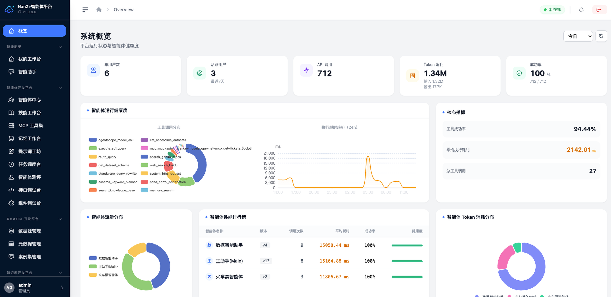 | 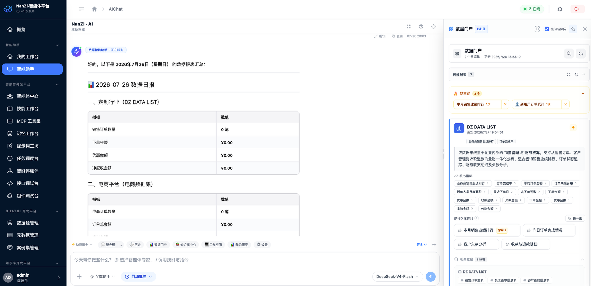 |
| **🧠 Memory & LTM** | **🔍 Memory Management Console** |
| 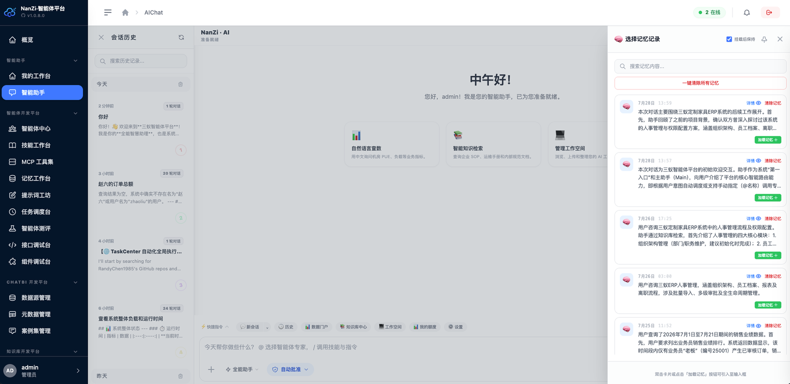 | 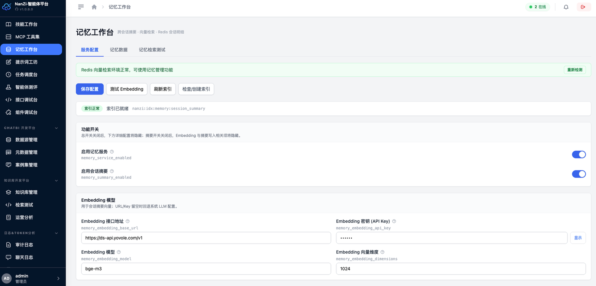 |
| **🛠️ Trace Timeline Debug** | **📚 Knowledge Hub** |
| 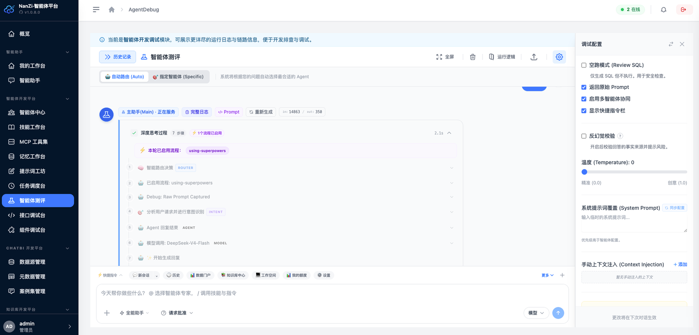 | 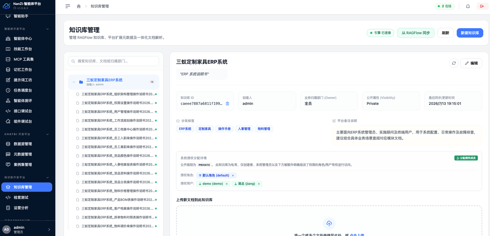 |
| **🤖 Agent Studio** | **📝 Prompt Playground** |
| 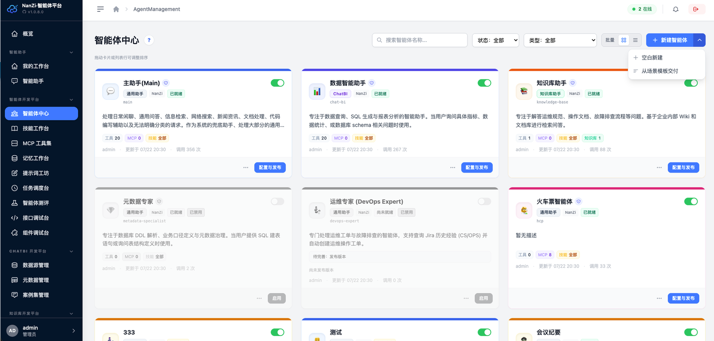 | 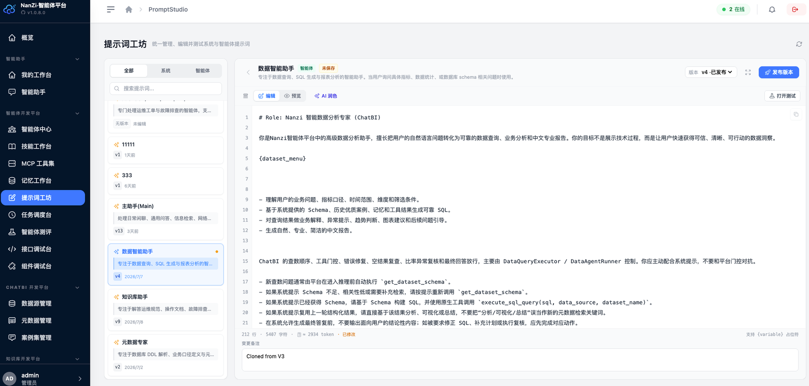 |
| **🔌 Physical Data Sources** | **📊 Metadata Builder** |
| 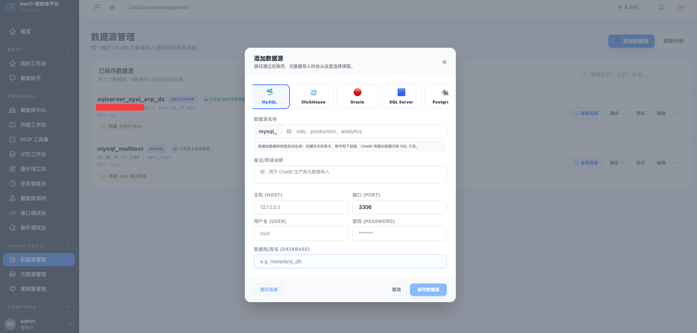 | 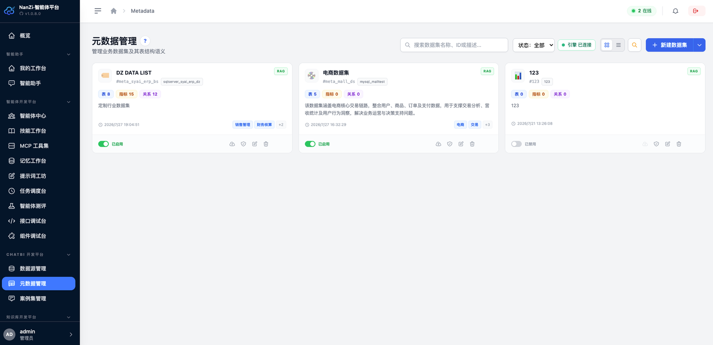 |
| **⚡ Dynamic Agent Skills** | **⚙️ System Settings** |
| 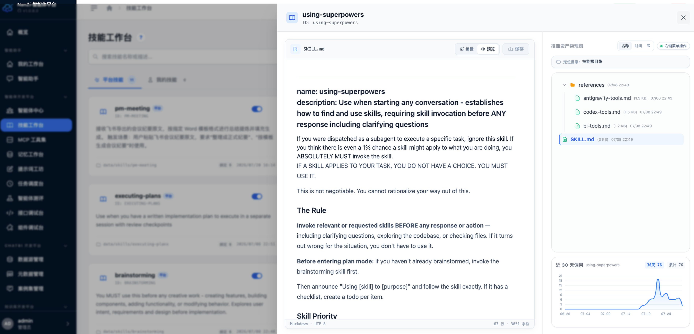 | 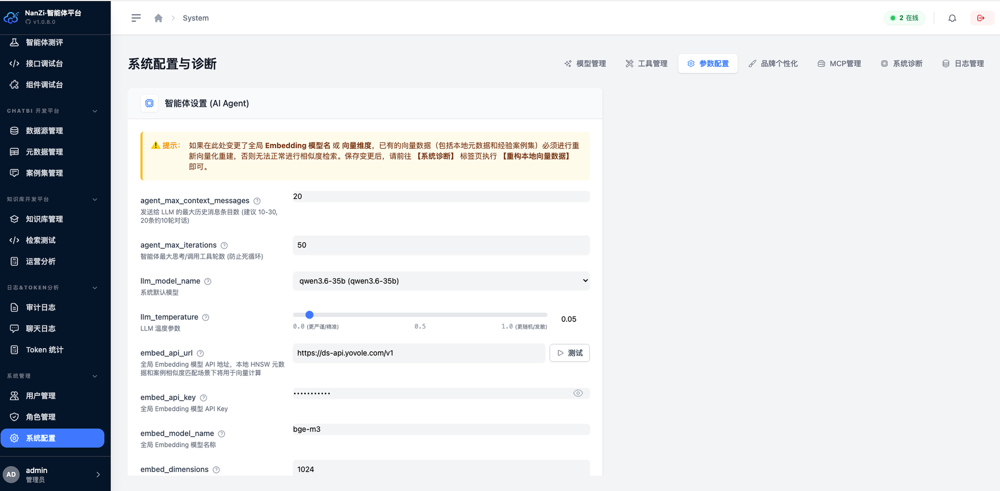 |

---

## 🌟 Core Capabilities

### 1. 🧠 Multi-Engine & Hybrid Orchestration
*   **Smart routing**: When no agent is specified, heuristic shortcuts (greetings, web search, ChatBI session break) run before LLM semantic routing; multi-intent parallel execution with Synthesizer aggregation.
*   **Direct expert selection**: Embed expert mode, `agent_id`, or `@mention` skips auto-routing and loads the chosen agent.
*   **AgentScope ReAct**: Assistant / ChatBI / Knowledge run on AgentScope Agent + Toolkit with permission suspend/resume.
*   **Thinking model compatibility**: Built-in `tool_choice_for_model` support and 6-tier `reasoning_effort` tuning for DeepSeek-R1, Kimi, GLM, etc.
*   **Main assistant extras**: Tool preflight (relevance-based nudge), skill auto-scan, anti–business-data hallucination guard with one-click ChatBI switch.
*   **RAGFlow managed agents**: Connect to RAGFlow-hosted bots for retrieval and streaming dialogue.
*   **OpenClaw🦞 gateway**: Passes `AUTH_CONTEXT` (identity, channel, accessible datasets) for tenant isolation.

### 2. 🛡️ Multi-Policy Sandbox & Execution Isolation
*   **Four sandbox policies**: Native support for `Local` (host process), `Docker` (private container), `E2B` (cloud sandbox), and `SSH` (remote secure host).
*   **Docker same-path workspace mounting**: User workspaces are mounted to identical absolute paths inside the container, mapping `/workspace/...` logical paths back to host files with real-time canvas preview and editing.
*   **Automated lifecycle management**: 30-minute idle reaper, graceful shutdown container cleanup, and prebuild enhancements.
*   **Chat input popover console**: Live status badge (🟢Running/🟡Starting/🔴Error/⚪Stopped), assigned container ID, **second-by-second live runtime counter**, and manual start/refresh controls.

### 3. 🌐 Persistent Browser & Live Takeover
*   **Comprehensive automation toolkit**: Navigation, element click, text input, human-like trajectory slider dragging, smart wait, keypress, full-page scroll, file upload, screenshots, and multi-tab management.
*   **Right-side Web interactive drawer**: Live stream snapshot rendering, allowing users to manually take over interaction or solve captchas at any time.

### 4. 📊 Context Management & Observability
*   **4-tier Token breakdown**: Visual breakdown across System Prompt, Tools Schema, Memory/History, and Current Turn.
*   **Two-stage structured compaction**: Automatic watermark trigger with `_structured_tool_block` extraction and multimodal tag preservation.
*   **30-Day long-term retention**: Redis session history, compaction logs, and artifact download links extended to 30 days.

### 5. 📊 Intelligent Warehouse Analysis (ChatBI & Self-Healing)
*   **Text-to-SQL loop**: Metadata injection, schema gates, and layered SQL guards.
*   **My Data Portal**: Slash command `/dataset_portal` (legacy `/dataset_menu` still works) for permission-aware navigation and quick follow-ups.
*   **Case library & Few-Shot**: Audited experience base with dynamic head-of-prompt injection.
*   **Self-healing & sql_plan**: SQL error repair rounds; optional `enable_sql_plan` for high-risk queries with structured `<sql_plan>` cards in the UI.
*   **Clarification short-circuit**: Non-data chit-chat clarified at classification without forcing SQL.
*   **Data sources**: Visual Oracle / ClickHouse / MySQL management, DDL sync, golden report stash, and direct physical SQL execution.

### 6. 🔌 Open Plugin Ecosystem (MCP Integration)
*   **Native MCP Support**: Fully compliant with Anthropic's Model Context Protocol.
*   **Infinite Extensibility**: Seamlessly connect to external productivity tools like Jira, Email, GitLab, etc. via MCP servers without modifying core code.

### 7. 📚 Deep Knowledge Enhancement & Integration (RAG & Knowledge Hub)
*   **Knowledge workbench**: Tree document management, slice preview, recall testing, semantic merge, lifecycle audit.
*   **Knowledge executor**: Auto `search_knowledge_base` prefetch before ReAct; citation cards; blocks uncited factual answers when retrieval is empty.
*   **RAGFlow managed path**: Optionally connect RAGFlow-hosted knowledge agents instead.

### 8. 🛠️ Enterprise Security, Audit & Utilities
*   **Automated Task Center & Notifications**: Distributed APScheduler + Redis scheduling under agent identities for Cron/periodic/one-off tasks; multi-channel alerts (**WeCom, DingTalk, Feishu, Email, Webhook, and In-App Inbox**) with thinking stream stripping and overflow protection.
*   **ChatBI Golden Report Alerts**: Scheduled report inspection with threshold-hit, deviation rate, consecutive hits, and no-data anomaly alerts.
*   **Multi-Provider Model Registry**: Built-in presets for OpenAI, Azure, DeepSeek, Kimi, Zhipu GLM, SiliconFlow, Alibaba DashScope, Volcengine Ark (Doubao), Ollama with smart endpoint normalization.
*   **Platform timezone**: System jobs and subscriptions without an explicit timezone use `platform_timezone` (default `Asia/Shanghai`).
*   **Granular RBAC**: User, role, menu, and element-level permissions.
*   **SSO & masking**: Toggleable SSO; audit logs mask passwords and API keys.
*   **Embed watermark**: Username + timestamp or custom overlay text against screenshot leaks.
*   **Trace & export**: Timeline debugging; CSV/Excel query exports (utf-8-sig).

---

## 🔄 Execution Flow

The system follows **Routing → Dispatch → Execution → Synthesis**:

1.  **Intent Router**: Without `agent_id`, heuristic shortcuts run first (greetings, web search, ChatBI session break → general assistant), then LLM routing with recent history and agent metadata; multi-agent hints supported.
2.  **Direct selection**: Embed expert mode, `agent_id`, or `@mention` bypasses the router.
3.  **Dispatcher**: Routes to **Knowledge** / **ChatBI (DataQuery)** / **Assistant** / RAGFlow / OpenClaw; ChatBI classifies new query vs reuse vs context action internally.
4.  **ReAct execution**: AgentScope reasoning-action loop with per-executor guards (SQL gates, tool preflight, permissions).
5.  **Synthesis**: Multi-agent answers aggregated by Synthesizer; single-agent streams SSE content, logs, and citations.

See [CHAT_FLOW.md](architech/design/chat/CHAT_FLOW.md) · [AGENT_ROUTING_DESIGN.md](architech/design/AGENT_ROUTING_DESIGN.md)

---

## 📚 Documentation

| Doc | Description |
|-----|-------------|
| [WeChat series (CN)](https://mp.weixin.qq.com/mp/appmsgalbum?__biz=MzU3NzAwOTA0NA==&action=getalbum&album_id=4613921118301732865#wechat_redirect) | Architecture, install, agent setup, ChatBI, toolbox, MCP |
| [HOW_TO_INSTALL.md](HOW_TO_INSTALL.md) | Installation & FAQ |
| [architech/README.md](architech/README.md) | Architecture index |
| [CHAT_FLOW.md](architech/design/chat/CHAT_FLOW.md) | End-to-end chat flow |
| [PROMPT_LAYERS.md](architech/design/chat/PROMPT_LAYERS.md) | Prompt layering |
| [AGENT_ROUTING_DESIGN.md](architech/design/AGENT_ROUTING_DESIGN.md) | Agent routing |
| [api_integration_guide.md](docs/md/api_integration_guide.md) | Embed / V1 API integration |
| [code_canvas_and_workspace_guide.md](docs/md/code_canvas_and_workspace_guide.md) | Code Canvas, workspace files, and execution API |
| [ai_agent_gating_contract.md](docs/md/ai_agent_gating_contract.md) | Agent gating contract |
| [tests/CHECKLIST.md](tests/CHECKLIST.md) | Test checklist |

---

## 📂 Project Structure

```text
.
├── app/                  # Backend core code (FastAPI)
│   ├── api/              # API router layer (Portal admin & Client V1 APIs)
│   ├── services/         # Business service layer (Auth, RAG knowledge, MCP plugin services)
│   │   └── ai/           # 🤖 AI Orchestration Center (AgentScope Runners, OpenClaw execution & intent dispatch)
│   └── models/           # SQLAlchemy ORM models
├── frontend/             # Admin console and embedded Chat SDK project (Vue 3 + Tailwind)
├── .agent/               # Agent-specific dev skills & workflow configs (opsx, etc.)
├── architech/            # High-level architecture specs & System Prompt management
├── db-prod/              # Database migrations & SQL upgrade scripts (V0-VNN)
├── docker/               # Containerization & one-click Docker-compose deployment solutions
├── scripts/              # Devops auxiliary scripts (one-click run, data sync, redeployment)
├── tests/                # Automated test suites & verification checklists (CHECKLIST.md)
└── openspec/             # OpenSpec API specifications & protocol trace files
```

---

## 🚀 Quick Start

### 🐳 Docker Deployment (Recommended)

**1. Configure environment**
```bash
cd docker
cp ../env.example .env   # DB, Redis, ENCRYPTION_KEY, etc.
```

**2. Build image and export tar**

| Script | Target |
| :--- | :--- |
| `./build_linux_x86.sh` | x86_64 Linux servers (most common) |
| `./build_linux_arm.sh` | ARM64 Linux (Kunpeng / Ampere, etc.) |
| `./build_native.sh` | Host native arch — local testing only |

```bash
# Production (x86) — also use this on Mac when deploying to x86 servers
./build_linux_x86.sh
```

Artifacts are written to **`docker/release/`**, e.g. `nanzi-ai-agent_linux-amd64_20250527.tar`. On the target host: `docker load -i docker/release/xxx.tar`.

> On Apple Silicon Macs deploying to x86 servers, use `build_linux_x86.sh`, not `build_native.sh`. The first cross-platform build may take a long time with little console output while base images are pulled.

**If `docker buildx` is unavailable** (common with Homebrew `docker` + Colima when `~/.docker/cli-plugins/docker-buildx` still points at uninstalled Docker Desktop):

```bash
cd docker
./install-buildx.sh
./build_linux_x86.sh
```

More details: [docker/README.md](docker/README.md) (Chinese) · [docker/README_EN.md](docker/README_EN.md) (English).

**3. Start services**
```bash
./start-nanzi-ai-agent.sh
```

### 🛠️ Development & Deployment Tools

#### 1. One-Click Local Development (Highly Recommended)
For daily local development, it is highly recommended to use the integration script at the repository root:
```bash
./dev.sh
```
This script will automatically terminate any stale processes on port 8001, compile frontend assets (skipping type-checks for speed), and launch the FastAPI backend service in `reload` mode. You can monitor live logs directly in your active terminal.

#### 2. Utility Scripts Comparison
We provide three utility scripts tailored for different development and deployment environments:

| Script | Mode | Frontend Build Method | Backend Execution Method | Best Use Case |
| :--- | :--- | :--- | :--- | :--- |
| `dev.sh` | **Foreground** Interactive | Quick Build (skips type check) | Active logging with `--reload` | Local debugging & troubleshooting |
| `scripts/redeploy-fast.sh` | **Background** Daemon | Quick Build (skips type check) | Runs in background via `nohup` | Fast hot updates in dev/test setups |
| `scripts/redeploy.sh` | **Background** Daemon | Full Build (includes `vue-tsc` checks) | Runs in background via `nohup` | Standard releases in production environments |

#### 3. Traditional Step-by-Step Manual Run
If you need to tweak the frontend or backend separately, you can run:
```bash
# 1. Setup environment
python -m venv venv && source venv/bin/activate
pip install -r requirements.txt

# 2. Run backend
uvicorn app.main:app --reload --port 8001

# 3. Run frontend
cd frontend && npm install && npm run dev
```

---

## 🤝 Contributing

1.  **Branching Policy**: Develop based on `main`. Feature branches should be named `feature/your-feature-name`.
2.  **Commit Message**: Commit messages must be written in **Chinese**, clearly describing your changes.
3.  **Verification**: Update `tests/CHECKLIST.md` when introducing new features.

---

## 💬 Contact & Community

If you have any questions, feature suggestions, or need further technical updates, please scan the QR code to follow our WeChat Official Account, or join our WeChat community group. You can also read the [NanZi Open-Source Agent Platform Series](https://mp.weixin.qq.com/mp/appmsgalbum?__biz=MzU3NzAwOTA0NA==&action=getalbum&album_id=4613921118301732865#wechat_redirect) (Chinese):

<table>
  <tr>
    <td align="center">
      <br/>
      <sub>WeChat Official Account</sub>
    </td>
    <td align="center">
      <br/>
      <sub>WeChat Community Group (valid for 7 days)</sub>
    </td>
  </tr>
</table>

Scan the group QR code to get a free platform trial account and access URL.

---

## 📄 License

This project is licensed under the MIT License - see the LICENSE file for details.

---
Copyright © 2025-2026 Randy Chen <cexlong@gmail.com>. All Rights Reserved.
