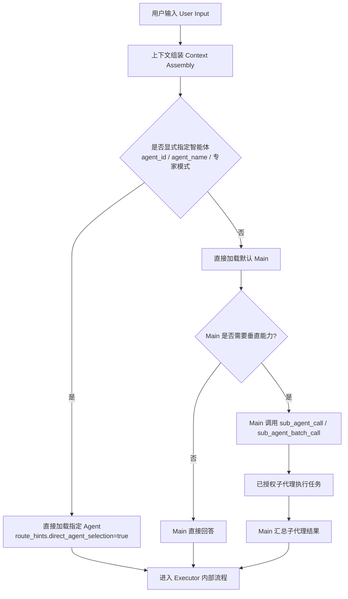

# 智能委派与专家直选设计 (Intelligent Delegation & Explicit Expert Selection)

本文档说明南孜智能体平台当前如何确定对话入口，以及由 `Main` 或指定专家按需委派子代理。

> **当前实现校准（2026-08-27）**：未指定专家时不再先做外层语义路由。请求直接进入默认 `Main`，由 Main 自己回答或调用 `sub_agent_call` / `sub_agent_batch_call`。`RouterService` 仅作为旧调用、常量和缓存失效的兼容保留，不是当前默认请求的运行时入口。

## 1. 核心入口与委派策略

平台采用 **“默认 Main + 按需智能委派”**。入口只区分用户是否显式指定了专家：未指定时直接加载 Main；指定 `agent_id`、`agent_name`、`version_id` 或使用 `@` / 专家模式时直接加载目标专家。Main 和指定的父专家都可以在自身执行过程中按需委派子代理。

委派层只负责在任务确实需要垂直能力时调用子代理，不负责替代 ChatBI 内部请求类别判断。ChatBI 的新查数 / 追问 / 结果分析与呈现 / 动作 / 元数据 / 非查数处置仍由 `DataQueryExecutor` 内部的 `DataQueryTurnClassifier` 判定。

### 1.1 入口与委派流程图

## 2. 逻辑详解

### 2.1 入口解析

入口解析只负责确定父智能体，不做问题语义选专家：

| 输入 | `TurnDecision` 来源 | 行为 |
|------|---------------------|------|
| 未指定 `agent_id` / `agent_name` / `version_id` | `default_main_delegation` | 直接加载默认 `Main` |
| 指定智能体或 `@` 提及 | `direct_agent_selection` | 直接加载目标专家 |

多轮历史、用户画像、可访问资源、技能和附件仍会注入实际执行 Prompt；它们用于帮助当前父智能体完成任务，不会再触发一轮外层专家匹配。

### 2.2 Main 的智能委派

Main 只有在任务需要其他专家的垂直能力时才委派：

1. 先判断是否可由自身直接回答或使用自身工具完成；
2. 需要单个垂直专家时调用 `sub_agent_call`；
3. 有多个互不依赖的子任务时调用 `sub_agent_batch_call`；
4. 委派目标必须来自当前用户有权调用、已发布且可用的候选范围；
5. 平台校验自委派、重复调用、超时、结果截断和最大嵌套深度；
6. Main 汇总子代理结果后统一向用户交付。

指定专家时逻辑保持一致：该专家直接成为父专家，若自身拥有委派能力且任务需要，仍可调用其他子代理。

### 2.3 专家直选与 Guard 边界

当请求携带 `agent_id`、`agent_name`、`version_id`，或 Embed **专家模式**选定智能体时：

- `AgentService` 设置 `route_hints.direct_agent_selection = True`；
- 直接加载指定智能体，不调用外层语义路由；
- 主通用助手的数据反幻觉 Guard 继续按 `direct_agent_selection` 边界处理。

### 2.4 Dispatcher 与内部分类边界

`AgentDispatcher` 根据已经解析出的 Agent、`TurnDecision.turn_kind`、引擎类型、能力和安全资格选择 Executor。进入 ChatBI 后，`DataQueryTurnClassifier` 只负责数据域内部的新查数、追问、结果复用、结果分析或上下文动作；它不会回写外层专家入口。

## 3. 关键组件与位置

- **默认入口解析**：`app/services/ai/context_manager.py` -> `resolve_agent_config()`
- **委派工具**：`app/services/ai/tools/agent_delegate_tool.py` -> `sub_agent_call` / `sub_agent_batch_call`
- **执行分发**：`app/services/ai/dispatcher.py`
- **智能体元数据与权限**：数据库 `ai_agents`、当前用户权限和运行时工具门控
- **兼容保留**：`app/services/ai/router_service.py`，用于旧调用、路由常量和缓存失效，不参与当前默认主链路

## 4. 相关配置与测试

| 配置/门禁 | 说明 |
|-----------|------|
| `routingMode=auto` | 前端兼容字段，产品语义为“智能委派” |
| `enable_multi_agent` | 允许 Main 使用批量委派处理独立子任务 |
| `max_subagent_depth` 等委派限制 | 防自委派、递归死循环、超时和过量结果 |

测试映射：

- `tests/services/ai/test_agent_context_manager.py` — 无指定专家直接解析默认 Main，指定专家直达
- `tests/ai/test_sub_agent_delegation.py` — 权限、深度、自委派、重复调用、并行委派与结果回传
- `tests/ai/test_tool_nudge_policy.py` — Main 的委派工具促发提示
