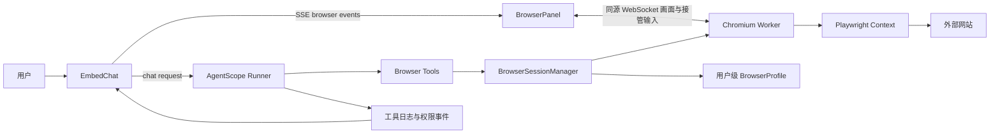

# 浏览器智能体右侧面板设计

> 状态：第一阶段 MVP 已实现，待用户在已启动环境中验收
>
> 目标版本：第一阶段支持服务端远程 Chromium、用户手动登录、百度搜索类连续操作，并为后续扩展到其他网站保留稳定的会话与工具边界。

## 1. 背景与现状

NanZi 当前已经具备网页相关能力，但这些能力属于网页抓取而不是浏览器交互：

- `app/services/ai/tools/advanced_auxiliary_tools.py` 中的 `web_renderer_and_snapshot` 会通过 Playwright 启动无头 Chromium，执行 `goto`、截图、HTML 文本提取，然后关闭浏览器。
- `web_search_baidu` 通过 Playwright 访问百度搜索结果，但没有暴露通用的点击、输入、滚动、键盘或持续会话能力。
- `frontend/src/components/embed/ChatCanvas.vue` 已经支持右侧钉住、宽度调整和桌面/移动端布局，但当前职责是 HTML、代码、PDF、图片、CSV、Mermaid 等内容预览。
- `frontend/src/views/EmbedChat.vue` 已经消费 AgentScope 的工具日志、权限暂停和外部执行暂停事件，并计算右侧钉住面板占用宽度。
- 平台已经支持 MCP SSE / Streamable HTTP 以及会话级 MCP 工具挂载，但 MCP 本身不能自动提供浏览器可视化、用户登录态和平台级浏览器权限策略。

因此，本功能不应直接扩展现有网页抓取工具，也不应把百度 URL 直接放进普通跨域 iframe，而应增加一个平台内置的、服务端运行的浏览器会话边界。

## 2. 目标

### 2.1 用户目标

用户在聊天中提出：

> 帮我打开百度，搜索“xxx”，再打开第一个结果。

平台应完成以下闭环：

1. Agent 创建或恢复当前用户的远程浏览器会话。
2. 聊天区继续显示 Agent 的思考和操作日志。
3. 右侧自动打开固定宽度的 BrowserPanel，显示远程 Chromium 当前页面。
4. 用户可以直接在 BrowserPanel 内手动登录或接管操作。
5. 用户完成登录后，Agent 可以继续调用浏览器工具。
6. 后续对话可以恢复同一用户的登录 Profile。
7. 用户可以在当前 BrowserSession 内切换安全协作模式与自动执行模式。

### 2.2 产品目标

- 支持服务端浏览器，不依赖用户本机 Chrome 扩展。
- 登录态按用户隔离并可跨对话复用。
- 普通搜索、导航、滚动、输入和非提交点击可以连续自动执行。
- 提交、发送、删除、下单、支付等外部影响动作受平台权限策略控制。
- 浏览器操作结果、页面截图和动作状态可在聊天与右侧面板中解释。
- 保留接入外部浏览器 MCP 的扩展点，但第一阶段不依赖外部 MCP 才能完成主流程。

### 2.3 非目标

第一阶段不包含：

- 复用用户本机 Chrome 的 Cookie 或浏览器扩展。
- 直接将任意第三方网站嵌入普通 iframe 并读取其 DOM。
- 暴露任意 JavaScript `evaluate` 给模型。
- 多标签页编排、跨浏览器协同和多用户共享浏览器。
- 后台定时任务长期自动操作需要登录的网站。
- 将密码、Cookie、完整页面录像或用户输入永久写入会话日志。

## 3. 方案选择

### 3.1 方案一：平台内置远程浏览器（采用）

服务端为用户创建隔离的 Chromium Context，Agent 通过平台内置 Browser Tools 操作，BrowserPanel 通过同源 WebSocket 接收画面并发送用户接管事件。

优点：

- Agent、用户和右侧面板共享同一个浏览器会话。
- 登录 Profile、权限、审计、截图策略由平台统一管理。
- 与现有 FastAPI、Playwright、AgentScope、SSE 和 EmbedChat 架构一致。
- 不要求用户安装本机浏览器扩展。

代价：

- 需要增加浏览器会话管理、画面传输和输入事件转发。
- 服务端需要管理 Chromium 进程、资源上限和异常回收。

### 3.2 方案二：外部浏览器 MCP

通过现有 MCP 管理页接入 Playwright MCP 或 Browser-use MCP，让 Agent 调用外部服务暴露的浏览器工具。

适合作为实验性接入或后续扩展，但不作为主实现，原因是浏览器画面、登录 Profile、用户接管、权限语义和跨对话恢复都会依赖外部服务的约定，难以与 NanZi 的会话和审计模型完全对齐。

### 3.3 方案三：直接 iframe 嵌入百度

不采用。跨域页面的 Cookie、CSP、`X-Frame-Options` 和 DOM 访问限制会使用户登录态与后端 Agent 操作态分离，也不能稳定支持智能体点击和输入。

## 4. 总体架构



### 4.1 浏览器 Profile 与运行 Session 分离

长期复用的是用户级 BrowserProfile，运行时使用的是 BrowserSession：

```text
BrowserProfile
- id
- user_id
- display_name
- encrypted_storage_ref
- status: active | disabled | deleted
- last_used_at

BrowserSession
- id
- profile_id
- attached_conversation_id
- current_url
- page_title
- approval_mode: guarded | autopilot
- status: active | waiting_user | detached | closed | crashed
- last_seen_at
```

Profile 保存用户认可的站点登录状态。BrowserSession 可以在对话之间重新挂载 Profile；浏览器进程是否持续运行不作为登录态持久化的前提。用户关闭右侧面板只表示解除查看，不等于清除登录态；“退出并清除浏览器数据”必须是独立的明确操作。

当前实现对同一用户 Profile 复用一个活动 BrowserSession，避免多个 Chromium Context 并发打开同一持久化目录；新对话会接管该 Session。

默认限制为每个用户、每个 Profile 同时只有一个 active BrowserSession。新对话如果发现已有 active Session，应显示“继续使用已有浏览器”或创建新的 Profile，不能静默抢占另一个对话的浏览器。

### 4.2 画面传输与用户接管

第一阶段采用同源 WebSocket：

- 后端以受控频率捕获当前 viewport 的 JPEG/PNG 帧。
- BrowserPanel 使用 `<canvas>` 或 `` 显示帧，不加载第三方网站 iframe。
- 用户的鼠标点击、滚轮、键盘和窗口尺寸事件通过 WebSocket 发回后端。
- 后端将事件转换为 Playwright 的 page mouse / keyboard 操作。
- WebSocket 只允许当前用户访问其对应的 `session_id`，并使用短时 viewer token 防止复制 URL 后越权。

画面传输层保留后续升级为 WebRTC 的边界；Browser Tools 与 BrowserPanel 不直接依赖具体传输协议。

## 5. Agent 工具协议

工具应使用稳定的 `session_id` 和页面语义引用，不把屏幕坐标作为 Agent 的主控制协议。

### 5.1 工具列表

```text
browser_session_open(url, profile_id?)
browser_snapshot(session_id)
browser_click(session_id, target_ref)
browser_fill(session_id, target_ref, value, sensitive=false)
browser_press(session_id, key)
browser_scroll(session_id, direction, amount?)
browser_wait(session_id, condition, timeout_ms?)
browser_back(session_id)
browser_forward(session_id)
browser_close(session_id, destroy_profile=false)
```

### 5.2 页面观察结果

`browser_snapshot` 和每次动作成功后的结果都应包含：

```json
{
  "session_id": "bs_xxx",
  "url": "https://www.baidu.com/",
  "title": "百度一下",
  "screenshot_ref": "media://browser/bs_xxx/frame_xxx",
  "elements": [
    {"ref": "e17", "role": "textbox", "name": "搜索框"},
    {"ref": "e18", "role": "button", "name": "百度一下"}
  ],
  "page_state": "ready"
}
```

模型使用最新 snapshot 中的 `target_ref`，例如点击 `e18`，而不是依赖易漂移的坐标或任意 CSS 选择器。服务端不提供通用 `evaluate` 工具，不允许模型执行任意页面 JavaScript。

### 5.3 用户登录暂停

当 Agent 需要用户手动登录时，BrowserSession 进入 `waiting_user`，SSE 推送 `browser_user_required`：

```json
{
  "type": "browser_user_required",
  "session_id": "bs_xxx",
  "reason": "请在右侧浏览器面板完成登录，完成后点击继续",
  "resume_action": "continue"
}
```

用户完成登录后点击“继续”，后端恢复该 BrowserSession，Agent 重新获取 snapshot 并继续。现有 AgentScope pending/resume 机制可以复用，但需要把 `session_id` 和浏览器面板上下文加入 pending snapshot，避免暂停恢复后丢失浏览器绑定。

## 6. AgentScope 与 SSE 集成

### 6.1 后端工具注册

新增第一方浏览器工具模块，并通过 `ToolRegistry` 注册。工具的 `source_type` 为 `static`，但 permission scope 不使用普通静态工具的默认推断，而由 BrowserPolicy 动态决定。

建议职责边界：

- `browser_profile_service.py`：Profile 创建、恢复、注销和用户隔离。
- `browser_session_service.py`：Session 状态、并发占用、挂起、恢复和回收。
- `browser_worker.py`：Playwright Context、页面操作、截图与输入事件。
- `browser_policy.py`：guarded / autopilot 和动作风险分类。
- `browser_tools.py`：面向 AgentScope 的工具参数与结果适配。
- `browser.py`：浏览器 Session、Viewer token、策略切换和用户接管 API。

### 6.2 SSE 事件

在现有 `log`、`permission_required` 和 `external_execution_required` 之外，增加浏览器专用事件：

```text
browser_panel_open
browser_state
browser_action
browser_user_required
browser_panel_close
```

其中：

- `browser_panel_open`：通知前端创建或显示 BrowserPanel。
- `browser_state`：同步 URL、标题、Session 状态和最新截图引用；不直接在 SSE 中携带大尺寸 base64 图片。
- `browser_action`：显示“已打开百度”“已输入 xxx”“已点击搜索”等用户可读操作状态。
- `browser_user_required`：暂停 Agent，要求用户在面板内登录或接管。
- `browser_panel_close`：Agent 或用户明确关闭 Session 后通知前端释放面板。

普通工具调用仍沿用现有工具日志事件，以确保历史回放和现有思考卡片不被破坏。

## 7. 前端交互设计

### 7.1 BrowserPanel

新增独立组件 `frontend/src/components/embed/BrowserPanel.vue`，复用现有右侧停靠行为，但不扩展 `ChatCanvas` 的文件预览数据类型。

面板结构：

1. 顶部：返回、前进、刷新、当前 URL、Session 状态。
2. 主区：远程 Chromium 画面。
3. 底部：当前 Agent 操作、登录等待提示、接管/继续/停止。
4. 设置区：当前 Session 的 guarded / autopilot 开关。
5. 退出区：关闭面板、断开 Session、退出并清除 Profile 数据。

### 7.2 EmbedChat 集成

`EmbedChat.vue` 继续作为布局编排者：

- 监听 `browser_panel_open` 并显示 BrowserPanel。
- 把 BrowserPanel 宽度加入现有 `totalPinnedDrawerPx` 计算。
- BrowserPanel 默认右侧钉住，默认宽度 520px，可拖拽调整。
- 移动端默认全屏覆盖聊天区，不与工作空间抽屉同时占用横向空间。
- 浏览器动作日志沿用现有消息日志与 AgentScope 时间线，面板只承载页面状态和接管控制。

建议新增 `useBrowserSession.ts`，负责 Session 加载、WebSocket 连接、状态重连、策略切换和面板关闭，不把浏览器连接细节塞进 `EmbedChat.vue`。

## 8. 权限与安全策略

### 8.1 当前 Session 级模式

```text
guarded
- 导航、搜索、滚动、普通输入和非提交点击：自动执行
- 发送、提交、删除、购买、支付、账号设置变更：触发 permission_required

autopilot
- 当前 BrowserSession 内连续执行浏览器动作
- 模式只保存在 BrowserSession，不写入用户默认设置
- BrowserSession 关闭后恢复 guarded
```

模式切换必须由后端校验用户身份和 Session 所属关系。前端按钮不能直接改变实际执行权限。

### 8.2 高风险动作识别

风险分类不能只依赖模型传入的 `risk` 字段。Browser Worker 至少需要综合：

- 元素 role 和 accessible name；
- 当前页面是否存在 form 提交；
- 目标按钮和链接文本中的发送、删除、购买、支付、确认等动作词；
- 当前 Session 的审批模式；
- 平台级禁止动作列表。

guarded 模式下，高风险目标必须拒绝直接执行并返回 `permission_required`。autopilot 模式可以连续执行，但仍受平台级禁止策略约束。

### 8.3 登录态与敏感数据

- MVP 使用服务端内部 Profile 路径并限制目录权限为 `0700`，不向 API 返回 Cookie；完整的 Profile 文件 at-rest 加密与注销物理清理仍需在生产化阶段补齐。
- `browser_fill(..., sensitive=true)` 的 value 不写入工具日志、SSE、Trace、错误信息或历史消息。
- 密码输入期间不保存页面截图到长期媒体工件。
- 浏览器 Cookie、Local Storage 和 IndexedDB 不向模型暴露。
- 浏览器注销必须删除对应 Profile 的持久化数据和服务端缓存。
- BrowserPanel、Viewer token、工具调用和 Profile API 都必须校验当前用户。

### 8.4 网络访问

- 所有初始 URL 和重定向 URL 都经过 URL 安全校验。
- 阻止访问平台内网、云元数据地址、Redis、数据库和本机管理端口。
- 每次导航重新检查最终解析地址，防止 DNS rebinding 绕过初始校验。
- 限制页面加载超时、单 Session 页面数量、并发 Session 数和截图频率。

## 9. 错误处理与状态恢复

| 场景 | 平台行为 |
|---|---|
| Chromium 启动失败 | BrowserPanel 显示启动失败，Agent 收到可解释错误，不继续盲目调用工具 |
| 页面加载超时 | 保留当前页面截图，返回超时状态，允许 Agent 重试一次 |
| WebSocket 断开 | 面板进入重连状态，BrowserSession 继续保留；超过 TTL 后进入 detached |
| 用户手动关闭面板 | 仅解除查看；Agent 若仍在运行则保持 Session，用户可重新打开 |
| 用户点击停止 | 取消当前 Agent 浏览器动作，Session 是否保留由用户选择 |
| 登录超时 | 结束 `waiting_user`，不把失败当成登录成功 |
| 新对话发现 Session 被其他对话占用 | 提示继续原对话、只读查看或创建新的 Profile，禁止静默抢占 |
| Profile 损坏 | 标记 Profile 为 disabled，保留诊断信息但不把 Cookie 内容写入日志 |

## 10. 建议文件边界

### 后端

- Create: `app/models/browser.py`
- Create: `app/schemas/browser.py`
- Create: `app/services/ai/browser/browser_profile_service.py`
- Create: `app/services/ai/browser/browser_session_service.py`
- Create: `app/services/ai/browser/browser_worker.py`
- Create: `app/services/ai/browser/browser_policy.py`
- Create: `app/services/ai/tools/browser_tools.py`
- Create: `app/api/v1/endpoints/browser.py`
- Modify: `app/services/ai/tools/registry.py`
- Modify: `app/services/ai/runtime/agentscope/tools.py`
- Modify: `app/services/ai/runtime/agentscope/event_stream.py`
- Modify: `app/services/ai/agent_service.py`
- Create: 按仓库当前迁移序号新增 `db-prod/` 下的浏览器会话迁移 SQL
- Create: 按仓库当前迁移序号新增 `db-prod-pg/` 下的浏览器会话迁移 SQL

### 前端

- Create: `frontend/src/components/embed/BrowserPanel.vue`
- Create: `frontend/src/composables/chat/useBrowserSession.ts`
- Create: `frontend/src/types/browser.ts`
- Modify: `frontend/src/views/EmbedChat.vue`
- Modify: AgentScope SSE 事件分发和日志映射模块

### 测试

- Create: `tests/services/ai/test_browser_profile_service.py`
- Create: `tests/services/ai/test_browser_session_service.py`
- Create: `tests/services/ai/test_browser_policy.py`
- Create: `tests/services/ai/test_browser_tools.py`
- Create: `tests/api/v1/test_browser_sessions.py`
- Create: `tests/ai/test_browser_agentscope_events.py`
- Create: `tests/frontend/test_browser_panel_contract.py`
- Modify: `tests/CHECKLIST.md`

## 11. 验收标准

### 百度搜索闭环

1. 用户发送“打开百度搜索 xxx”。
2. Agent 创建或恢复当前用户 BrowserSession。
3. 右侧 BrowserPanel 自动打开并展示百度。
4. Agent 通过 semantic target ref 输入 `xxx` 并点击搜索。
5. 聊天日志显示每一步，浏览器面板显示真实页面变化。
6. 用户可以在面板内手动登录后点击继续，Agent 能恢复执行。
7. 新建对话后可以复用同一用户 Profile 的登录态。

### 模式开关

1. 新 BrowserSession 默认 guarded。
2. guarded 下点击发送、删除、购买等目标会暂停并显示确认。
3. 用户切换 autopilot 后，当前 Session 可以连续执行允许的高风险动作。
4. 关闭 BrowserSession 后再次打开默认回到 guarded。
5. 仅修改前端开关不能绕过后端策略。

### 隔离与安全

1. 用户 A 无法打开用户 B 的 Session、Viewer 或 Profile。
2. 密码和 Cookie 不出现在日志、SSE、Trace 和历史消息。
3. 内网和云元数据地址被阻断，且重定向不能绕过检查。
4. BrowserPanel 断线后可以恢复画面，不会自动创建跨用户 Session。

## 12. 分阶段实现顺序

### 阶段一：会话与最小浏览器工具

实现 BrowserProfile、BrowserSession、Playwright Context、`browser_session_open`、`browser_snapshot` 和百度导航；先使用内存/临时 Profile 验证生命周期，再接入持久化存储。

### 阶段二：右侧面板与用户接管

实现 BrowserPanel、同源 WebSocket、截图帧、键盘鼠标事件转发、登录等待和继续按钮。

### 阶段三：完整 Agent 工具链

实现 click、fill、press、scroll、wait、back、forward，并将语义元素引用、截图引用和动作日志接入 AgentScope。

### 阶段四：策略和持久化

实现 guarded / autopilot 后端策略、权限暂停恢复、用户级 Profile 跨对话恢复、加密存储和注销清理。

### 阶段五：回归与真实验收

补齐后端单元测试、API 测试、SSE 事件测试、前端契约测试，并由用户在已启动服务和已登录浏览器环境中完成真实百度登录、搜索、断线恢复和跨对话复用验收。
